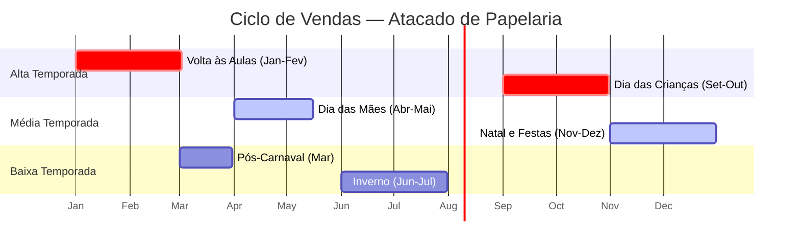
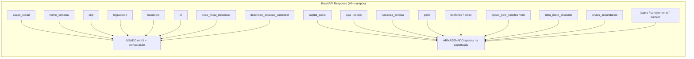
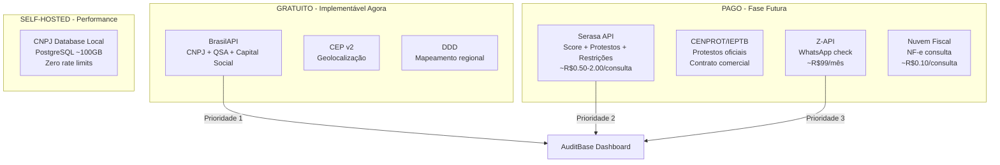
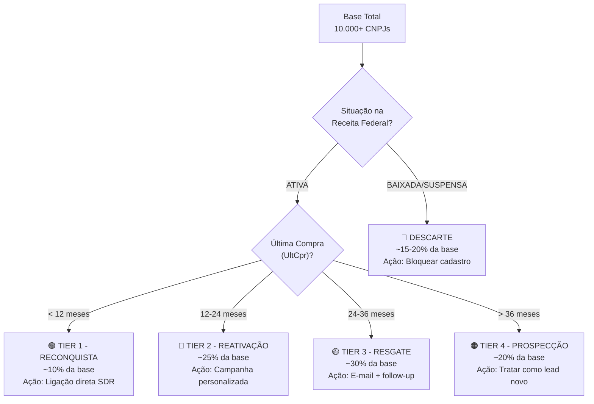
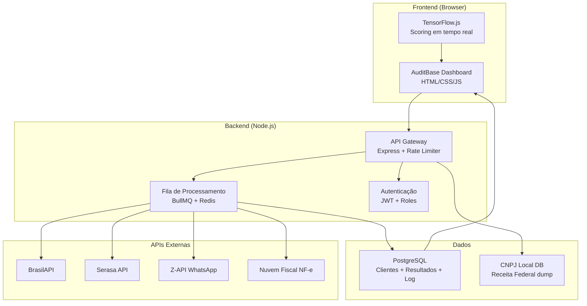

# AuditBase - Código Fonte Completo e Relatório Estratégico

Este arquivo contém todo o código fonte e documentação do projeto para análise.


## Arquivo: index.html
```

<!DOCTYPE html>
<html lang="pt-BR">
<head>
  <meta charset="UTF-8">
  <meta name="viewport" content="width=device-width, initial-scale=1.0">
  <title>AuditBase — Dashboard de Auditoria Cadastral de CNPJs</title>
  <meta name="description" content="Dashboard inteligente para auditoria e higienização de base cadastral de CNPJs com integração à Receita Federal">
  <link rel="preconnect" href="https://fonts.googleapis.com">
  <link rel="preconnect" href="https://fonts.gstatic.com" crossorigin>
  <link href="https://fonts.googleapis.com/css2?family=Inter:wght@300;400;500;600;700;800&family=JetBrains+Mono:wght@400;500&display=swap" rel="stylesheet">
  <link rel="stylesheet" href="styles.css">
  <link rel="icon" href="data:image/svg+xml,<svg xmlns='http://www.w3.org/2000/svg' viewBox='0 0 32 32'><text y='28' font-size='28'>🛡️</text></svg>">
</head>
<body>

  <!-- Toast Container -->
  <div id="toast-container" class="toast-container"></div>

  <!-- Header -->
  <header class="header">
    <div class="header-content">
      <div class="header-logo">
        <svg class="logo-icon" width="32" height="32" viewBox="0 0 24 24" fill="none" stroke="url(#logo-gradient)" stroke-width="2" stroke-linecap="round" stroke-linejoin="round">
          <defs>
            <linearGradient id="logo-gradient" x1="0%" y1="0%" x2="100%" y2="100%">
              <stop offset="0%" style="stop-color:#60a5fa"/>
              <stop offset="100%" style="stop-color:#a78bfa"/>
            </linearGradient>
          </defs>
          <path d="M12 22s8-4 8-10V5l-8-3-8 3v7c0 6 8 10 8 10z"/>
          <path d="M9 12l2 2 4-4"/>
        </svg>
        <h1>AuditBase</h1>
        <span class="header-badge">Protótipo v1.0</span>
      </div>
      <div class="header-actions">
        <div class="export-dropdown" id="export-dropdown">
          <button class="btn btn-export" id="btn-export" disabled title="Exportar resultados processados">
            <svg width="16" height="16" viewBox="0 0 24 24" fill="none" stroke="currentColor" stroke-width="2"><path d="M21 15v4a2 2 0 0 1-2 2H5a2 2 0 0 1-2-2v-4"/><polyline points="7 10 12 15 17 10"/><line x1="12" y1="15" x2="12" y2="3"/></svg>
            Exportar ▾
          </button>
          <div class="export-menu hidden" id="export-menu">
            <button class="export-menu-item" id="btn-export-csv">📄 Exportar CSV</button>
            <button class="export-menu-item" id="btn-export-xlsx">📊 Exportar Excel (.xlsx)</button>
            <button class="export-menu-item" id="btn-export-json">🔧 Exportar JSON (reimportável)</button>
          </div>
        </div>
        <button class="btn btn-secondary" id="btn-import-results" title="Importar análise anterior (JSON ou XLSX)">
          <svg width="16" height="16" viewBox="0 0 24 24" fill="none" stroke="currentColor" stroke-width="2"><path d="M21 15v4a2 2 0 0 1-2 2H5a2 2 0 0 1-2-2v-4"/><polyline points="17 8 12 3 7 8"/><line x1="12" y1="3" x2="12" y2="15"/></svg>
          Importar Análise
        </button>
        <input type="file" id="import-results-input" class="file-input" accept=".json,.xlsx">
      </div>
    </div>
  </header>

  <!-- Main Container -->
  <div class="container">

    <!-- Upload Section -->
    <section class="upload-section" id="upload-section">
      <span class="section-title">📁 Importação de Dados</span>
      <div class="upload-area" id="upload-area">
        <div class="upload-icon">📂</div>
        <div class="upload-text">
          <strong>Arraste seu arquivo CSV ou XLSX aqui</strong><br>
          ou clique para selecionar
        </div>
        <div class="upload-formats">Formatos aceitos: .csv (UTF-8) e .xlsx (Excel)</div>
        <input type="file" id="file-input" class="file-input" accept=".csv,.xlsx,.xls">
      </div>
      <div class="file-info hidden" id="file-info">
        <svg width="20" height="20" viewBox="0 0 24 24" fill="none" stroke="var(--green-400)" stroke-width="2"><path d="M14 2H6a2 2 0 0 0-2 2v16a2 2 0 0 0 2 2h12a2 2 0 0 0 2-2V8z"/><polyline points="14 2 14 8 20 8"/></svg>
        <div>
          <div class="file-name" id="file-name"></div>
          <div class="file-size" id="file-size"></div>
        </div>
        <button class="file-remove" id="file-remove" title="Remover arquivo">✕</button>
      </div>
      <div class="template-download">
        <button class="btn btn-secondary btn-sm" id="btn-template">
          <svg width="14" height="14" viewBox="0 0 24 24" fill="none" stroke="currentColor" stroke-width="2"><path d="M21 15v4a2 2 0 0 1-2 2H5a2 2 0 0 1-2-2v-4"/><polyline points="7 10 12 15 17 10"/><line x1="12" y1="15" x2="12" y2="3"/></svg>
          Baixar Template CSV
        </button>
      </div>
    </section>

    <!-- Config Bar -->
    <div class="config-bar" id="config-bar">
      <div class="mode-toggle">
        <input type="radio" id="mode-batch" name="mode" value="batch" checked>
        <label for="mode-batch">🔄 Em Lote (Batch)</label>
        <input type="radio" id="mode-unit" name="mode" value="unit">
        <label for="mode-unit">🎯 Unitário</label>
      </div>

      <div class="cnpj-input-wrapper hidden" id="cnpj-input-wrapper">
        <input type="text" class="cnpj-input" id="cnpj-direct-input" placeholder="00.000.000/0001-00" maxlength="18">
        <button class="btn btn-primary btn-sm" id="btn-search-cnpj" title="Consultar CNPJ">
          <svg width="16" height="16" viewBox="0 0 24 24" fill="none" stroke="currentColor" stroke-width="2"><circle cx="11" cy="11" r="8"/><path d="m21 21-4.35-4.35"/></svg>
          Consultar
        </button>
      </div>

      <div class="config-actions">
        <button class="btn btn-primary" id="btn-process" disabled>
          <svg width="16" height="16" viewBox="0 0 24 24" fill="none" stroke="currentColor" stroke-width="2"><polygon points="5 3 19 12 5 21 5 3"/></svg>
          <span id="btn-process-text">Iniciar Processamento</span>
        </button>
        <button class="btn btn-secondary hidden" id="btn-cancel">
          <svg width="16" height="16" viewBox="0 0 24 24" fill="none" stroke="currentColor" stroke-width="2"><rect x="3" y="3" width="18" height="18" rx="2" ry="2"/></svg>
          Parar
        </button>
      </div>
    </div>

    <!-- Metrics Section -->
    <section class="metrics-section" id="metrics-section">
      <div class="metric-card total">
        <div class="metric-icon">📊</div>
        <div class="metric-value" id="metric-total">0</div>
        <div class="metric-label">Total de Clientes</div>
      </div>
      <div class="metric-card processed">
        <div class="metric-icon">⏳</div>
        <div class="metric-value" id="metric-processed">0</div>
        <div class="metric-label">Processados</div>
        <div class="metric-sublabel" id="metric-processed-pct"></div>
      </div>
      <div class="metric-card active">
        <div class="metric-icon">✅</div>
        <div class="metric-value" id="metric-active">0</div>
        <div class="metric-label">Ativos sem Divergência</div>
      </div>
      <div class="metric-card divergent">
        <div class="metric-icon">⚠️</div>
        <div class="metric-value" id="metric-divergent">0</div>
        <div class="metric-label">Com Divergência</div>
      </div>
      <div class="metric-card critical">
        <div class="metric-icon">🚫</div>
        <div class="metric-value" id="metric-critical">0</div>
        <div class="metric-label">Inativos / Críticos</div>
      </div>
      <div class="metric-card health">
        <div class="metric-icon">💚</div>
        <div class="metric-value" id="metric-health">—</div>
        <div class="metric-label">Saúde da Base</div>
        <div class="health-bar">
          <div class="health-bar-fill" id="health-bar-fill" style="width: 0%"></div>
        </div>
      </div>
    </section>

    <!-- Progress Section -->
    <div class="progress-section" id="progress-section">
      <div class="progress-bar-container">
        <div class="progress-bar" id="progress-bar" style="width: 0%"></div>
      </div>
      <div class="progress-info">
        <span id="progress-current">Processando...</span>
        <span id="progress-eta">Estimativa: calculando...</span>
      </div>
    </div>

    <!-- Main Content -->
    <main class="main-content" id="main-content">

      <!-- Table Section -->
      <section class="table-section">
        <!-- Table Controls -->
        <div class="table-controls">
          <div class="search-input-wrapper">
            <svg class="search-icon" width="16" height="16" viewBox="0 0 24 24" fill="none" stroke="currentColor" stroke-width="2"><circle cx="11" cy="11" r="8"/><path d="m21 21-4.35-4.35"/></svg>
            <input type="text" class="search-input" id="search-input" placeholder="Buscar por CNPJ ou Razão Social...">
          </div>
          <select class="filter-select" id="filter-status">
            <option value="">Todos os Status</option>
            <option value="pending">⏸ Pendente</option>
            <option value="processing">🔄 Processando</option>
            <option value="success">✅ Sucesso</option>
            <option value="divergence">⚠️ Divergência</option>
            <option value="error">❌ Erro</option>
          </select>
          <select class="filter-select" id="filter-priority">
            <option value="">Todas as Prioridades</option>
            <option value="ALTA">🔴 Alta</option>
            <option value="MEDIA">🟡 Média</option>
            <option value="BAIXA">🟢 Baixa</option>
            <option value="NENHUMA">⚪ Nenhuma</option>
          </select>
          <div class="table-count" id="table-count"></div>
        </div>

        <!-- Data Table -->
        <div class="table-wrapper" id="table-wrapper">
          <table id="data-table">
            <thead>
              <tr>
                <th class="w-16">#</th>
                <th>CNPJ</th>
                <th>Razão Social</th>
                <th>Vendedor</th>
                <th>Status</th>
                <th>Prioridade</th>
                <th class="w-24">Ação</th>
              </tr>
            </thead>
            <tbody id="table-body">
            </tbody>
          </table>

          <!-- Empty State -->
          <div class="empty-state" id="empty-state">
            <div class="empty-icon">📋</div>
            <div class="empty-text">Importe um arquivo CSV para começar a auditoria</div>
            <div class="empty-subtext">Utilize o template para garantir a formatação correta dos dados</div>
          </div>
        </div>

        <!-- Pagination -->
        <div class="pagination hidden" id="pagination">
          <button class="pagination-btn" id="page-prev" title="Página anterior">
            <svg width="16" height="16" viewBox="0 0 24 24" fill="none" stroke="currentColor" stroke-width="2"><polyline points="15 18 9 12 15 6"/></svg>
          </button>
          <div class="pagination-pages" id="pagination-pages"></div>
          <button class="pagination-btn" id="page-next" title="Próxima página">
            <svg width="16" height="16" viewBox="0 0 24 24" fill="none" stroke="currentColor" stroke-width="2"><polyline points="9 18 15 12 9 6"/></svg>
          </button>
          <span class="pagination-info" id="pagination-info"></span>
        </div>
      </section>
    </main>
  </div>

  <!-- Detail Panel Overlay -->
  <div class="detail-overlay" id="detail-overlay"></div>

  <!-- Detail Panel -->
  <aside class="detail-panel" id="detail-panel">
    <div class="detail-header">
      <div>
        <div class="detail-title" id="detail-title">—</div>
        <div class="detail-subtitle" id="detail-cnpj">—</div>
      </div>
      <button class="detail-close" id="detail-close" title="Fechar painel">
        <svg width="18" height="18" viewBox="0 0 24 24" fill="none" stroke="currentColor" stroke-width="2"><line x1="18" y1="6" x2="6" y2="18"/><line x1="6" y1="6" x2="18" y2="18"/></svg>
      </button>
    </div>

    <!-- Status Badge in detail -->
    <div class="detail-status-row" id="detail-status-row">
      <span class="status-badge" id="detail-status-badge"></span>
      <span class="priority-badge" id="detail-priority-badge"></span>
    </div>

    <!-- Recommendation Card -->
    <div class="recommendation-card" id="recommendation-card">
      <div class="rec-label">🤖 Recomendação da IA</div>
      <div class="rec-text" id="rec-text">—</div>
    </div>

    <!-- Insights Comerciais -->
    <div class="detail-section" id="commercial-insights-section">
      <div class="detail-section-title">
        <svg width="16" height="16" viewBox="0 0 24 24" fill="none" stroke="var(--cyan-500)" stroke-width="2"><polyline points="22 12 18 12 15 21 9 3 6 12 2 12"></polyline></svg>
        Insights Comerciais VPA
      </div>
      <div class="commercial-insights-grid">
        <div class="insight-card">
          <div class="insight-label">Score VPA</div>
          <div class="insight-value" id="insight-score-vpa">—</div>
        </div>
        <div class="insight-card">
          <div class="insight-label">Tempo Inativo</div>
          <div class="insight-value" id="insight-dias-inativos">—</div>
        </div>
        <div class="insight-card">
          <div class="insight-label">Vendedor</div>
          <div class="insight-value" id="insight-vendedor">—</div>
        </div>
      </div>
      <div class="score-breakdown">
        <div class="score-breakdown-title">Composição do Score:</div>
        <div class="score-bars" id="score-breakdown-bars">
          <!-- Populated dynamically -->
        </div>
      </div>
    </div>

    <!-- Data Comparison -->
    <div class="detail-section">
      <div class="detail-section-title">
        <svg width="16" height="16" viewBox="0 0 24 24" fill="none" stroke="currentColor" stroke-width="2"><path d="M16 21v-2a4 4 0 0 0-4-4H5a4 4 0 0 0-4 4v2"/><circle cx="8.5" cy="7" r="4"/><line x1="20" y1="8" x2="20" y2="14"/><line x1="23" y1="11" x2="17" y2="11"/></svg>
        Cruzamento de Dados
      </div>
      <div class="comparison-grid">
        <div class="data-block internal">
          <div class="data-block-title">📋 Dados Internos</div>
          <div id="internal-data-fields"></div>
        </div>
        <div class="data-block official">
          <div class="data-block-title">🏛️ Receita Federal</div>
          <div id="official-data-fields"></div>
        </div>
      </div>
    </div>

    <!-- Divergences Summary -->
    <div class="detail-section" id="divergences-section">
      <div class="detail-section-title">
        <svg width="16" height="16" viewBox="0 0 24 24" fill="none" stroke="var(--yellow-400)" stroke-width="2"><path d="M10.29 3.86L1.82 18a2 2 0 0 0 1.71 3h16.94a2 2 0 0 0 1.71-3L13.71 3.86a2 2 0 0 0-3.42 0z"/><line x1="12" y1="9" x2="12" y2="13"/><line x1="12" y1="17" x2="12.01" y2="17"/></svg>
        Divergências Encontradas
      </div>
      <div id="divergences-list"></div>
    </div>

    <!-- Web Intelligence -->
    <div class="detail-section">
      <div class="detail-section-title">
        <svg width="16" height="16" viewBox="0 0 24 24" fill="none" stroke="var(--cyan-500)" stroke-width="2"><circle cx="12" cy="12" r="10"/><line x1="2" y1="12" x2="22" y2="12"/><path d="M12 2a15.3 15.3 0 0 1 4 10 15.3 15.3 0 0 1-4 10 15.3 15.3 0 0 1-4-10 15.3 15.3 0 0 1 4-10z"/></svg>
        Inteligência Web
      </div>
      <div class="web-intel-card" id="web-intel-card">
        <div class="web-intel-status" id="web-intel-status"></div>
        <a class="web-intel-link" id="web-intel-link" href="#" target="_blank" rel="noopener"></a>
        <div class="web-intel-summary" id="web-intel-summary">—</div>
      </div>
    </div>

    <!-- Full Receita Data Accordion -->
    <div class="detail-section">
      <div class="detail-section-title">
        <svg width="16" height="16" viewBox="0 0 24 24" fill="none" stroke="currentColor" stroke-width="2"><path d="M14 2H6a2 2 0 0 0-2 2v16a2 2 0 0 0 2 2h12a2 2 0 0 0 2-2V8z"/><polyline points="14 2 14 8 20 8"/></svg>
        Dados Completos da Receita
      </div>
      <div class="accordion">
        <button class="accordion-header" id="accordion-header">
          <span>Expandir JSON completo</span>
          <svg class="chevron" width="16" height="16" viewBox="0 0 24 24" fill="none" stroke="currentColor" stroke-width="2"><polyline points="6 9 12 15 18 9"/></svg>
        </button>
        <div class="accordion-body" id="accordion-body">
          <div class="accordion-body-content">
            <pre id="receita-json">—</pre>
          </div>
        </div>
      </div>
    </div>
  </aside>

  <!-- SheetJS for XLSX support (loaded from CDN) -->
  <script src="https://cdn.sheetjs.com/xlsx-0.20.3/package/dist/xlsx.full.min.js"></script>

  <!-- Scripts (order matters: utils → api → app) -->
  <script src="utils.js"></script>
  <script src="api.js"></script>
  <script src="app.js"></script>
</body>
</html>

```


## Arquivo: styles.css
```

/* ==========================================================================
   CNPJ Audit Dashboard — Premium Dark-Theme Design System
   Version: 1.0.0
   
   Table of Contents:
   1.  Design Tokens (CSS Custom Properties)
   2.  Reset & Base Styles
   3.  Scrollbar Styling
   4.  Header
   5.  Main Container
   6.  Upload Section
   7.  Config Bar
   8.  Buttons
   9.  Metrics Section
   10. Progress Section
   11. Table Section
   12. Status & Priority Badges
   13. Pagination
   14. Detail Panel
   15. Web Intelligence Section
   16. Recommendation Card
   17. Receita Full Data Accordion
   18. Spinner
   19. Empty / Loading States
   20. Toast Notifications
   21. Keyframe Animations
   22. Utility Classes
   23. Responsive — 1024px
   24. Responsive — 768px
   25. Responsive — 480px
   ========================================================================== */


/* ==========================================================================
   1. Design Tokens
   ========================================================================== */

:root {
  /* Backgrounds */
  --bg-primary: #060a13;
  --bg-secondary: #0d1321;
  --bg-surface: #111827;
  --bg-surface-hover: #1a2332;
  --bg-card: rgba(17, 24, 39, 0.7);
  --bg-card-hover: rgba(26, 35, 50, 0.8);

  /* Glass effect */
  --glass-bg: rgba(17, 24, 39, 0.6);
  --glass-border: rgba(255, 255, 255, 0.06);
  --glass-blur: 20px;

  /* Accent colors */
  --blue-500: #3b82f6;
  --blue-400: #60a5fa;
  --blue-600: #2563eb;
  --purple-500: #8b5cf6;
  --purple-400: #a78bfa;
  --green-500: #10b981;
  --green-400: #34d399;
  --yellow-500: #f59e0b;
  --yellow-400: #fbbf24;
  --red-500: #ef4444;
  --red-400: #f87171;
  --cyan-500: #06b6d4;

  /* Text */
  --text-primary: #f1f5f9;
  --text-secondary: #94a3b8;
  --text-muted: #64748b;
  --text-inverse: #0f172a;

  /* Borders */
  --border-subtle: rgba(255, 255, 255, 0.06);
  --border-default: rgba(255, 255, 255, 0.1);
  --border-strong: rgba(255, 255, 255, 0.15);

  /* Spacing */
  --space-xs: 0.25rem;
  --space-sm: 0.5rem;
  --space-md: 1rem;
  --space-lg: 1.5rem;
  --space-xl: 2rem;
  --space-2xl: 3rem;
  --space-3xl: 4rem;

  /* Radius */
  --radius-sm: 6px;
  --radius-md: 10px;
  --radius-lg: 16px;
  --radius-xl: 24px;
  --radius-full: 9999px;

  /* Shadows */
  --shadow-sm: 0 1px 2px rgba(0, 0, 0, 0.3);
  --shadow-md: 0 4px 12px rgba(0, 0, 0, 0.4);
  --shadow-lg: 0 8px 32px rgba(0, 0, 0, 0.5);
  --shadow-glow-blue: 0 0 20px rgba(59, 130, 246, 0.15);
  --shadow-glow-green: 0 0 20px rgba(16, 185, 129, 0.15);
  --shadow-glow-red: 0 0 20px rgba(239, 68, 68, 0.15);

  /* Transitions */
  --transition-fast: 150ms ease;
  --transition-base: 250ms ease;
  --transition-slow: 400ms ease;
  --transition-panel: 350ms cubic-bezier(0.4, 0, 0.2, 1);
}


/* ==========================================================================
   2. Reset & Base Styles
   ========================================================================== */

*,
*::before,
*::after {
  box-sizing: border-box;
  margin: 0;
  padding: 0;
}

html {
  -webkit-font-smoothing: antialiased;
  -moz-osx-font-smoothing: grayscale;
  text-rendering: optimizeLegibility;
}

body {
  font-family: 'Inter', -apple-system, BlinkMacSystemFont, 'Segoe UI', Roboto,
    Oxygen, Ubuntu, Cantarell, 'Helvetica Neue', sans-serif;
  background-color: var(--bg-primary);
  color: var(--text-primary);
  min-height: 100vh;
  line-height: 1.6;
  font-size: 16px;
}

h1 {
  font-weight: 700;
  line-height: 1.2;
}

h2 {
  font-weight: 600;
  line-height: 1.3;
}

h3 {
  font-weight: 600;
  line-height: 1.4;
}

a {
  color: var(--blue-400);
  text-decoration: none;
}

a:hover {
  text-decoration: underline;
}

img,
svg {
  display: block;
  max-width: 100%;
}

input,
button,
select,
textarea {
  font: inherit;
  color: inherit;
}


/* ==========================================================================
   3. Scrollbar Styling
   ========================================================================== */

/* Firefox */
* {
  scrollbar-width: thin;
  scrollbar-color: rgba(255, 255, 255, 0.12) transparent;
}

/* WebKit (Chrome, Safari, Edge) */
::-webkit-scrollbar {
  width: 6px;
  height: 6px;
}

::-webkit-scrollbar-track {
  background: transparent;
}

::-webkit-scrollbar-thumb {
  background-color: rgba(255, 255, 255, 0.12);
  border-radius: var(--radius-full);
}

::-webkit-scrollbar-thumb:hover {
  background-color: rgba(255, 255, 255, 0.2);
}

::-webkit-scrollbar-corner {
  background: transparent;
}


/* ==========================================================================
   4. Header
   ========================================================================== */

.header {
  position: fixed;
  top: 0;
  left: 0;
  right: 0;
  height: 64px;
  background: var(--glass-bg);
  backdrop-filter: blur(var(--glass-blur));
  -webkit-backdrop-filter: blur(var(--glass-blur));
  border-bottom: 1px solid var(--glass-border);
  z-index: 100;
}

.header-content {
  max-width: 1400px;
  margin: 0 auto;
  padding: 0 var(--space-xl);
  height: 100%;
  display: flex;
  align-items: center;
  justify-content: space-between;
}

.header-logo {
  display: flex;
  align-items: center;
  gap: var(--space-sm);
}

.header-logo .logo-icon {
  width: 32px;
  height: 32px;
  flex-shrink: 0;
  color: var(--blue-400);
}

.header-logo h1 {
  font-size: 1.25rem;
  font-weight: 700;
  background: linear-gradient(135deg, var(--blue-400), var(--purple-400));
  -webkit-background-clip: text;
  -webkit-text-fill-color: transparent;
  background-clip: text;
  line-height: 1;
}

.header-badge {
  display: inline-flex;
  align-items: center;
  padding: 3px 10px;
  border-radius: var(--radius-full);
  font-size: 0.65rem;
  font-weight: 500;
  text-transform: uppercase;
  letter-spacing: 0.05em;
  color: var(--text-muted);
  background: rgba(100, 116, 139, 0.12);
  border: 1px solid var(--border-subtle);
  margin-left: var(--space-sm);
}

.header-actions {
  display: flex;
  align-items: center;
  gap: var(--space-sm);
}


/* ==========================================================================
   5. Main Container
   ========================================================================== */

.container {
  max-width: 1400px;
  margin: 0 auto;
  padding: 80px var(--space-xl) var(--space-xl);
}


/* ==========================================================================
   6. Upload Section
   ========================================================================== */

.upload-section {
  margin-bottom: var(--space-xl);
}

.section-title {
  font-size: 0.75rem;
  text-transform: uppercase;
  letter-spacing: 0.1em;
  color: var(--text-muted);
  margin-bottom: var(--space-md);
  font-weight: 600;
}

.upload-area {
  background: var(--glass-bg);
  backdrop-filter: blur(var(--glass-blur));
  -webkit-backdrop-filter: blur(var(--glass-blur));
  padding: var(--space-2xl);
  border: 2px dashed var(--border-default);
  border-radius: var(--radius-lg);
  text-align: center;
  cursor: pointer;
  transition: border-color var(--transition-base),
              background-color var(--transition-base),
              box-shadow var(--transition-base);
}

.upload-area:hover {
  border-color: var(--blue-500);
  background: rgba(17, 24, 39, 0.75);
}

.upload-area.dragover {
  border-color: var(--blue-400);
  border-style: solid;
  background: rgba(59, 130, 246, 0.05);
  box-shadow: var(--shadow-glow-blue);
}

.upload-area.has-file {
  border-style: solid;
  border-color: var(--green-500);
}

.upload-icon {
  font-size: 3rem;
  margin-bottom: var(--space-md);
  opacity: 0.6;
  line-height: 1;
}

.upload-text {
  color: var(--text-secondary);
  max-width: 400px;
  margin: 0 auto;
  font-size: 0.9rem;
  line-height: 1.5;
}

.upload-text strong {
  color: var(--text-primary);
  font-weight: 600;
}

.upload-formats {
  font-size: 0.75rem;
  color: var(--text-muted);
  margin-top: var(--space-sm);
}

.file-input {
  display: none;
}

.file-info {
  display: flex;
  align-items: center;
  gap: var(--space-md);
  background: var(--bg-surface);
  padding: var(--space-md) var(--space-lg);
  border-radius: var(--radius-md);
  margin-top: var(--space-md);
  border: 1px solid var(--border-subtle);
}

.file-info .file-name {
  font-weight: 500;
  color: var(--text-primary);
  font-size: 0.875rem;
}

.file-info .file-size {
  font-size: 0.8rem;
  color: var(--text-muted);
}

.file-info .file-remove {
  margin-left: auto;
  cursor: pointer;
  color: var(--red-400);
  background: none;
  border: none;
  font-size: 0.85rem;
  padding: var(--space-xs) var(--space-sm);
  border-radius: var(--radius-sm);
  transition: opacity var(--transition-fast),
              background-color var(--transition-fast);
}

.file-info .file-remove:hover {
  opacity: 0.8;
  background: rgba(239, 68, 68, 0.1);
}


/* ==========================================================================
   7. Config Bar
   ========================================================================== */

.config-bar {
  display: flex;
  align-items: center;
  gap: var(--space-lg);
  flex-wrap: wrap;
  margin-bottom: var(--space-xl);
}

/* --- Mode Toggle (radio pills) --- */
.mode-toggle {
  display: flex;
  background: var(--bg-surface);
  border-radius: var(--radius-full);
  padding: 4px;
  border: 1px solid var(--border-subtle);
}

.mode-toggle label {
  padding: 8px 20px;
  border-radius: var(--radius-full);
  font-size: 0.85rem;
  cursor: pointer;
  transition: background-color var(--transition-fast),
              color var(--transition-fast),
              font-weight var(--transition-fast);
  color: var(--text-secondary);
  user-select: none;
  white-space: nowrap;
}

.mode-toggle input[type='radio'] {
  display: none;
}

.mode-toggle input[type='radio']:checked + label {
  background: var(--blue-500);
  color: #ffffff;
  font-weight: 500;
}

/* --- CNPJ Input --- */
.cnpj-input-wrapper {
  display: flex;
  position: relative;
}

.cnpj-input {
  background: var(--bg-surface);
  border: 1px solid var(--border-default);
  border-radius: var(--radius-md);
  padding: 10px 16px;
  color: var(--text-primary);
  font-family: inherit;
  width: 240px;
  font-size: 0.875rem;
  transition: border-color var(--transition-fast),
              box-shadow var(--transition-fast);
}

.cnpj-input::placeholder {
  color: var(--text-muted);
}

.cnpj-input:focus {
  border-color: var(--blue-500);
  outline: none;
  box-shadow: 0 0 0 3px rgba(59, 130, 246, 0.15);
}

/* --- Config Actions --- */
.config-actions {
  display: flex;
  gap: var(--space-sm);
  margin-left: auto;
}


/* ==========================================================================
   8. Buttons
   ========================================================================== */

.btn {
  display: inline-flex;
  align-items: center;
  justify-content: center;
  gap: var(--space-sm);
  padding: 10px 24px;
  border-radius: var(--radius-md);
  font-family: inherit;
  font-size: 0.875rem;
  font-weight: 500;
  cursor: pointer;
  transition: all var(--transition-fast);
  border: none;
  white-space: nowrap;
  line-height: 1.4;
}

/* Primary */
.btn-primary {
  background: linear-gradient(135deg, var(--blue-500), var(--blue-600));
  color: #ffffff;
  box-shadow: var(--shadow-sm);
}

.btn-primary:hover {
  filter: brightness(1.1);
  transform: translateY(-1px);
  box-shadow: var(--shadow-md);
}

.btn-primary:active {
  transform: translateY(0);
}

.btn-primary:disabled {
  opacity: 0.5;
  cursor: not-allowed;
  transform: none;
  filter: none;
}

.btn-primary.processing {
  position: relative;
  overflow: hidden;
  pointer-events: none;
}

.btn-primary.processing::after {
  content: '';
  position: absolute;
  top: 0;
  left: 0;
  width: 200%;
  height: 100%;
  background: linear-gradient(
    90deg,
    transparent,
    rgba(255, 255, 255, 0.15),
    transparent
  );
  animation: shimmer 1.5s infinite;
}

/* Secondary */
.btn-secondary {
  background: transparent;
  border: 1px solid var(--border-default);
  color: var(--text-secondary);
}

.btn-secondary:hover {
  border-color: var(--text-muted);
  color: var(--text-primary);
  background: var(--bg-surface);
}

/* Export */
.btn-export {
  background: transparent;
  border: 1px solid rgba(16, 185, 129, 0.3);
  color: var(--green-400);
}

.btn-export:hover {
  background: rgba(16, 185, 129, 0.05);
  border-color: rgba(16, 185, 129, 0.5);
}

/* Icon-only */
.btn-icon {
  padding: 10px;
  min-width: 40px;
  min-height: 40px;
  background: transparent;
  border: 1px solid var(--border-subtle);
  color: var(--text-secondary);
  border-radius: var(--radius-md);
}

.btn-icon:hover {
  background: var(--bg-surface-hover);
  color: var(--text-primary);
  border-color: var(--border-default);
}


/* ==========================================================================
   9. Metrics Section
   ========================================================================== */

.metrics-section {
  display: grid;
  grid-template-columns: repeat(auto-fit, minmax(200px, 1fr));
  gap: var(--space-md);
  margin-bottom: var(--space-xl);
}

.metric-card {
  background: var(--bg-card);
  backdrop-filter: blur(12px);
  -webkit-backdrop-filter: blur(12px);
  padding: var(--space-lg);
  border-radius: var(--radius-lg);
  border: 1px solid var(--border-subtle);
  position: relative;
  overflow: hidden;
  transition: transform var(--transition-fast),
              box-shadow var(--transition-fast);
}

.metric-card:hover {
  transform: translateY(-2px);
  box-shadow: var(--shadow-md);
}

/* Coloured top-edge accent — base pseudo-element */
.metric-card::before {
  content: '';
  position: absolute;
  top: 0;
  left: 0;
  width: 100%;
  height: 3px;
}

.metric-card.total::before {
  background: linear-gradient(90deg, var(--blue-500), var(--blue-400));
}

.metric-card.processed::before {
  background: linear-gradient(90deg, var(--purple-500), var(--purple-400));
}

.metric-card.active::before {
  background: linear-gradient(90deg, var(--green-500), var(--green-400));
}

.metric-card.divergent::before {
  background: linear-gradient(90deg, var(--yellow-500), var(--yellow-400));
}

.metric-card.critical::before {
  background: linear-gradient(90deg, var(--red-500), var(--red-400));
}

.metric-card.health::before {
  background: linear-gradient(90deg, var(--green-500), var(--yellow-500), var(--red-500));
}

.metric-icon {
  font-size: 1.5rem;
  margin-bottom: var(--space-sm);
  line-height: 1;
}

.metric-value {
  font-size: 2rem;
  font-weight: 800;
  color: var(--text-primary);
  line-height: 1;
}

.metric-label {
  font-size: 0.8rem;
  color: var(--text-muted);
  margin-top: var(--space-xs);
  text-transform: uppercase;
  letter-spacing: 0.05em;
  font-weight: 500;
}

.metric-sublabel {
  font-size: 0.75rem;
  color: var(--text-muted);
  margin-top: 2px;
}

/* Health bar within a metric card */
.health-bar {
  height: 6px;
  border-radius: var(--radius-full);
  background: var(--bg-surface-hover);
  margin-top: var(--space-sm);
  overflow: hidden;
}

.health-bar-fill {
  height: 100%;
  border-radius: var(--radius-full);
  background: linear-gradient(90deg, var(--red-500), var(--yellow-500), var(--green-500));
  transition: width 0.8s ease;
}


/* ==========================================================================
   10. Progress Section
   ========================================================================== */

.progress-section {
  margin-bottom: var(--space-xl);
  display: none;
}

.progress-section.active {
  display: block;
}

.progress-bar-container {
  height: 4px;
  border-radius: var(--radius-full);
  background: var(--bg-surface);
  overflow: hidden;
}

.progress-bar {
  height: 100%;
  border-radius: var(--radius-full);
  background: linear-gradient(90deg, var(--blue-500), var(--purple-500));
  transition: width 0.3s ease;
  position: relative;
}

/* Shimmer highlight on top of the progress bar */
.progress-bar::after {
  content: '';
  position: absolute;
  top: 0;
  left: 0;
  width: 50%;
  height: 100%;
  background: linear-gradient(
    90deg,
    transparent,
    rgba(255, 255, 255, 0.25),
    transparent
  );
  animation: shimmer 1.8s ease infinite;
}

.progress-info {
  display: flex;
  justify-content: space-between;
  margin-top: var(--space-sm);
  font-size: 0.8rem;
  color: var(--text-muted);
}


/* ==========================================================================
   11. Table Section
   ========================================================================== */

.table-section {
  margin-bottom: var(--space-xl);
}

/* --- Table Controls (search, filter, actions) --- */
.table-controls {
  display: flex;
  align-items: center;
  gap: var(--space-md);
  margin-bottom: var(--space-md);
  flex-wrap: wrap;
}

/* Search input */
.search-input-wrapper {
  position: relative;
  flex-grow: 1;
  max-width: 360px;
}

.search-input-wrapper .search-icon {
  position: absolute;
  left: 12px;
  top: 50%;
  transform: translateY(-50%);
  color: var(--text-muted);
  pointer-events: none;
  font-size: 0.9rem;
}

.search-input {
  width: 100%;
  background: var(--bg-surface);
  border: 1px solid var(--border-subtle);
  border-radius: var(--radius-md);
  padding: 10px 16px 10px 40px;
  color: var(--text-primary);
  font-family: inherit;
  font-size: 0.875rem;
  transition: border-color var(--transition-fast),
              box-shadow var(--transition-fast);
}

.search-input::placeholder {
  color: var(--text-muted);
}

.search-input:focus {
  border-color: var(--blue-500);
  outline: none;
  box-shadow: 0 0 0 3px rgba(59, 130, 246, 0.15);
}

/* Filter select */
.filter-select {
  background: var(--bg-surface);
  border: 1px solid var(--border-subtle);
  border-radius: var(--radius-md);
  padding: 10px 36px 10px 16px;
  color: var(--text-secondary);
  font-family: inherit;
  font-size: 0.85rem;
  cursor: pointer;
  appearance: none;
  -webkit-appearance: none;
  -moz-appearance: none;
  background-image: url("data:image/svg+xml,%3Csvg xmlns='http://www.w3.org/2000/svg' width='12' height='12' viewBox='0 0 24 24' fill='none' stroke='%2364748b' stroke-width='2' stroke-linecap='round' stroke-linejoin='round'%3E%3Cpolyline points='6 9 12 15 18 9'%3E%3C/polyline%3E%3C/svg%3E");
  background-repeat: no-repeat;
  background-position: right 12px center;
  transition: border-color var(--transition-fast);
}

.filter-select:focus {
  border-color: var(--blue-500);
  outline: none;
}

.filter-select:hover {
  border-color: var(--border-default);
}

/* --- Table Wrapper --- */
.table-wrapper {
  overflow-x: auto;
  border-radius: var(--radius-lg);
  border: 1px solid var(--border-subtle);
}

/* --- Table --- */
table {
  width: 100%;
  border-collapse: collapse;
}

thead {
  background: var(--bg-surface);
}

th {
  padding: 14px 16px;
  text-align: left;
  font-size: 0.75rem;
  text-transform: uppercase;
  letter-spacing: 0.05em;
  color: var(--text-muted);
  font-weight: 600;
  border-bottom: 1px solid var(--border-subtle);
  white-space: nowrap;
}

th:first-child {
  padding-left: 20px;
}

th:last-child {
  padding-right: 20px;
}

tbody tr {
  border-bottom: 1px solid var(--border-subtle);
  transition: background-color var(--transition-fast);
  cursor: pointer;
}

tbody tr:last-child {
  border-bottom: none;
}

tbody tr:hover {
  background: var(--bg-surface-hover);
}

tbody tr.highlighted {
  background: rgba(239, 68, 68, 0.03);
  border-left: 3px solid var(--red-500);
}

tbody tr.active-row {
  background: rgba(59, 130, 246, 0.05);
  border-left: 3px solid var(--blue-500);
}

td {
  padding: 12px 16px;
  font-size: 0.875rem;
  color: var(--text-secondary);
  white-space: nowrap;
}

td:first-child {
  padding-left: 20px;
}

td:last-child {
  padding-right: 20px;
}

td.cnpj-cell {
  font-family: 'JetBrains Mono', 'Fira Code', 'Cascadia Code', 'Source Code Pro',
    ui-monospace, SFMono-Regular, Menlo, Monaco, Consolas, monospace;
  font-size: 0.82rem;
  color: var(--text-primary);
  letter-spacing: 0.02em;
}

td.razao-cell {
  max-width: 250px;
  overflow: hidden;
  text-overflow: ellipsis;
}


/* ==========================================================================
   12. Status & Priority Badges
   ========================================================================== */

/* --- Status Badges --- */
.status-badge {
  display: inline-flex;
  align-items: center;
  gap: 6px;
  padding: 4px 12px;
  border-radius: var(--radius-full);
  font-size: 0.75rem;
  font-weight: 500;
  white-space: nowrap;
}

.status-badge .status-dot {
  width: 6px;
  height: 6px;
  border-radius: 50%;
  background: currentColor;
  flex-shrink: 0;
}

.status-badge.pending {
  background: rgba(100, 116, 139, 0.15);
  color: var(--text-muted);
}

.status-badge.processing {
  background: rgba(59, 130, 246, 0.15);
  color: var(--blue-400);
}

.status-badge.processing .status-dot {
  animation: pulse 1.5s ease-in-out infinite;
}

.status-badge.success {
  background: rgba(16, 185, 129, 0.15);
  color: var(--green-400);
}

.status-badge.divergence {
  background: rgba(245, 158, 11, 0.15);
  color: var(--yellow-400);
}

.status-badge.error {
  background: rgba(239, 68, 68, 0.15);
  color: var(--red-400);
}

/* --- Priority Badges --- */
.priority-badge {
  display: inline-flex;
  align-items: center;
  justify-content: center;
  padding: 3px 10px;
  border-radius: var(--radius-sm);
  font-size: 0.7rem;
  font-weight: 700;
  text-transform: uppercase;
  letter-spacing: 0.05em;
  white-space: nowrap;
}

.priority-badge.alta {
  background: rgba(239, 68, 68, 0.15);
  color: var(--red-400);
  border: 1px solid rgba(239, 68, 68, 0.25);
}

.priority-badge.media {
  background: rgba(245, 158, 11, 0.15);
  color: var(--yellow-400);
  border: 1px solid rgba(245, 158, 11, 0.25);
}

.priority-badge.baixa {
  background: rgba(16, 185, 129, 0.15);
  color: var(--green-400);
  border: 1px solid rgba(16, 185, 129, 0.25);
}

.priority-badge.nenhuma {
  background: rgba(100, 116, 139, 0.1);
  color: var(--text-muted);
  border: 1px solid var(--border-subtle);
}


/* ==========================================================================
   13. Pagination
   ========================================================================== */

.pagination {
  display: flex;
  justify-content: center;
  align-items: center;
  gap: var(--space-sm);
  margin-top: var(--space-lg);
}

.pagination-btn {
  width: 36px;
  height: 36px;
  display: flex;
  align-items: center;
  justify-content: center;
  border-radius: var(--radius-sm);
  background: transparent;
  border: 1px solid var(--border-subtle);
  color: var(--text-secondary);
  cursor: pointer;
  transition: background-color var(--transition-fast),
              color var(--transition-fast),
              border-color var(--transition-fast);
  font-size: 0.85rem;
  font-weight: 500;
}

.pagination-btn.active {
  background: var(--blue-500);
  color: #ffffff;
  border-color: var(--blue-500);
}

.pagination-btn:hover:not(.active) {
  background: var(--bg-surface-hover);
}

.pagination-btn:disabled {
  opacity: 0.4;
  cursor: not-allowed;
}

.pagination-info {
  font-size: 0.8rem;
  color: var(--text-muted);
  padding: 0 var(--space-sm);
}


/* ==========================================================================
   14. Detail Panel (Slide-out)
   ========================================================================== */

/* Overlay behind the panel */
.detail-overlay {
  position: fixed;
  inset: 0;
  background: rgba(0, 0, 0, 0.5);
  z-index: 999;
  opacity: 0;
  pointer-events: none;
  transition: opacity var(--transition-panel);
}

.detail-overlay.open {
  opacity: 1;
  pointer-events: auto;
}

/* Panel */
.detail-panel {
  position: fixed;
  top: 0;
  right: 0;
  height: 100vh;
  width: 520px;
  max-width: 90vw;
  background: var(--bg-secondary);
  border-left: 1px solid var(--border-subtle);
  transform: translateX(100%);
  transition: transform var(--transition-panel);
  z-index: 1000;
  overflow-y: auto;
  padding: var(--space-xl);
  box-shadow: -8px 0 32px rgba(0, 0, 0, 0.5);
}

.detail-panel.open {
  transform: translateX(0);
}

/* Panel header */
.detail-header {
  display: flex;
  justify-content: space-between;
  align-items: flex-start;
  margin-bottom: var(--space-xl);
  padding-bottom: var(--space-lg);
  border-bottom: 1px solid var(--border-subtle);
}

.detail-title {
  font-size: 1.1rem;
  font-weight: 600;
  color: var(--text-primary);
}

.detail-subtitle {
  font-size: 0.85rem;
  color: var(--text-muted);
  font-family: 'JetBrains Mono', 'Fira Code', ui-monospace, SFMono-Regular,
    Menlo, Monaco, Consolas, monospace;
  margin-top: var(--space-xs);
}

.detail-close {
  width: 32px;
  height: 32px;
  display: flex;
  align-items: center;
  justify-content: center;
  border-radius: 50%;
  background: var(--bg-surface);
  border: 1px solid var(--border-subtle);
  color: var(--text-muted);
  cursor: pointer;
  transition: color var(--transition-fast),
              background-color var(--transition-fast);
  flex-shrink: 0;
}

.detail-close:hover {
  color: #ffffff;
  background: var(--bg-surface-hover);
}

/* Panel sections */
.detail-section {
  margin-bottom: var(--space-xl);
}

.detail-section-title {
  font-size: 0.75rem;
  text-transform: uppercase;
  letter-spacing: 0.1em;
  color: var(--text-muted);
  margin-bottom: var(--space-md);
  display: flex;
  align-items: center;
  gap: var(--space-sm);
  font-weight: 600;
}

/* Comparison grid (internal vs official) */
.comparison-grid {
  display: grid;
  grid-template-columns: 1fr 1fr;
  gap: var(--space-md);
}

.data-block {
  background: var(--bg-surface);
  border-radius: var(--radius-md);
  padding: var(--space-md);
  border: 1px solid var(--border-subtle);
}

.data-block-title {
  font-size: 0.7rem;
  text-transform: uppercase;
  letter-spacing: 0.08em;
  color: var(--text-muted);
  margin-bottom: var(--space-sm);
  font-weight: 600;
}

.data-block.internal .data-block-title {
  color: var(--blue-400);
}

.data-block.official .data-block-title {
  color: var(--green-400);
}

/* Field rows inside data blocks */
.field-row {
  padding: 8px 0;
  border-bottom: 1px solid var(--border-subtle);
  font-size: 0.82rem;
}

.field-row:last-child {
  border-bottom: none;
}

.field-label {
  color: var(--text-muted);
  font-size: 0.7rem;
  text-transform: uppercase;
  letter-spacing: 0.05em;
  margin-bottom: 2px;
  font-weight: 500;
}

.field-value {
  color: var(--text-primary);
  word-break: break-word;
}

/* Divergent field highlight */
.field-row.divergent {
  background: rgba(245, 158, 11, 0.05);
  margin: 0 calc(var(--space-md) * -1);
  padding: 8px var(--space-md);
  border-radius: var(--radius-sm);
}

.field-row.divergent .field-value {
  color: var(--yellow-400);
  font-weight: 500;
}

.divergence-indicator {
  display: inline-flex;
  align-items: center;
  gap: 4px;
  font-size: 0.7rem;
  color: var(--yellow-400);
  margin-left: var(--space-sm);
}


/* ==========================================================================
   15. Web Intelligence Section
   ========================================================================== */

.web-intel-card {
  background: var(--bg-surface);
  border-radius: var(--radius-md);
  padding: var(--space-lg);
  border: 1px solid var(--border-subtle);
}

.web-intel-link {
  display: flex;
  align-items: center;
  gap: var(--space-sm);
  color: var(--blue-400);
  text-decoration: none;
  font-size: 0.85rem;
  margin-bottom: var(--space-sm);
  transition: color var(--transition-fast);
}

.web-intel-link:hover {
  text-decoration: underline;
  color: var(--blue-400);
}

.web-intel-summary {
  font-size: 0.85rem;
  color: var(--text-secondary);
  line-height: 1.5;
}

.web-intel-status {
  display: flex;
  align-items: center;
  gap: var(--space-sm);
  margin-bottom: var(--space-sm);
  font-size: 0.82rem;
}

.web-intel-status .dot {
  width: 8px;
  height: 8px;
  border-radius: 50%;
  flex-shrink: 0;
}

.web-intel-status .dot.active {
  background: var(--green-500);
}

.web-intel-status .dot.inactive {
  background: var(--red-500);
}


/* ==========================================================================
   16. Recommendation Card
   ========================================================================== */

.recommendation-card {
  background: linear-gradient(
    135deg,
    rgba(59, 130, 246, 0.08),
    rgba(139, 92, 246, 0.08)
  );
  border: 1px solid rgba(59, 130, 246, 0.2);
  border-radius: var(--radius-md);
  padding: var(--space-lg);
}

.recommendation-card .rec-label {
  font-size: 0.7rem;
  text-transform: uppercase;
  letter-spacing: 0.1em;
  color: var(--purple-400);
  font-weight: 600;
  margin-bottom: var(--space-sm);
}

.recommendation-card .rec-text {
  font-size: 0.9rem;
  color: var(--text-primary);
  line-height: 1.5;
  font-weight: 500;
}


/* ==========================================================================
   17. Receita Full Data Accordion
   ========================================================================== */

.accordion {
  border: 1px solid var(--border-subtle);
  border-radius: var(--radius-md);
  overflow: hidden;
}

.accordion-header {
  padding: 12px var(--space-md);
  background: var(--bg-surface);
  cursor: pointer;
  display: flex;
  justify-content: space-between;
  align-items: center;
  font-size: 0.8rem;
  color: var(--text-secondary);
  transition: background-color var(--transition-fast);
  user-select: none;
}

.accordion-header:hover {
  background: var(--bg-surface-hover);
}

.accordion-header .chevron {
  transition: transform var(--transition-fast);
  font-size: 0.75rem;
  color: var(--text-muted);
}

.accordion-header.open .chevron {
  transform: rotate(180deg);
}

.accordion-body {
  max-height: 0;
  overflow: hidden;
  transition: max-height 0.3s ease;
}

.accordion-body.open {
  max-height: 600px;
}

.accordion-body-content {
  padding: var(--space-md);
  font-family: 'JetBrains Mono', 'Fira Code', ui-monospace, SFMono-Regular,
    Menlo, Monaco, Consolas, monospace;
  font-size: 0.75rem;
  color: var(--text-secondary);
  white-space: pre-wrap;
  line-height: 1.6;
  max-height: 400px;
  overflow-y: auto;
  background: var(--bg-primary);
  border-top: 1px solid var(--border-subtle);
}


/* ==========================================================================
   18. Spinner
   ========================================================================== */

.spinner {
  width: 18px;
  height: 18px;
  border: 2px solid var(--border-subtle);
  border-top-color: var(--blue-400);
  border-radius: 50%;
  animation: spin 0.6s linear infinite;
  flex-shrink: 0;
}

.spinner-large {
  width: 40px;
  height: 40px;
  border-width: 3px;
}


/* ==========================================================================
   19. Empty / Loading States
   ========================================================================== */

.empty-state {
  text-align: center;
  padding: var(--space-3xl);
  color: var(--text-muted);
}

.empty-state .empty-icon {
  font-size: 3rem;
  margin-bottom: var(--space-md);
  opacity: 0.4;
  line-height: 1;
}

.empty-state .empty-text {
  font-size: 0.9rem;
  max-width: 360px;
  margin: 0 auto;
  line-height: 1.5;
}


/* ==========================================================================
   20. Toast Notifications
   ========================================================================== */

.toast-container {
  position: fixed;
  top: 80px;
  right: var(--space-xl);
  z-index: 2000;
  display: flex;
  flex-direction: column;
  gap: var(--space-sm);
  pointer-events: none;
}

.toast {
  background: var(--bg-surface);
  border: 1px solid var(--border-subtle);
  border-radius: var(--radius-md);
  padding: 14px 20px;
  font-size: 0.85rem;
  color: var(--text-primary);
  box-shadow: var(--shadow-lg);
  display: flex;
  align-items: center;
  gap: var(--space-sm);
  animation: slideInRight 0.3s ease;
  min-width: 300px;
  max-width: 440px;
  pointer-events: auto;
}

.toast.success {
  border-left: 3px solid var(--green-500);
}

.toast.error {
  border-left: 3px solid var(--red-500);
}

.toast.warning {
  border-left: 3px solid var(--yellow-500);
}

.toast.hiding {
  animation: slideOutRight 0.3s ease forwards;
}


/* ==========================================================================
   21. Keyframe Animations
   ========================================================================== */

@keyframes spin {
  to {
    transform: rotate(360deg);
  }
}

@keyframes pulse {
  0%,
  100% {
    opacity: 1;
  }
  50% {
    opacity: 0.4;
  }
}

@keyframes slideInRight {
  from {
    transform: translateX(100%);
    opacity: 0;
  }
  to {
    transform: translateX(0);
    opacity: 1;
  }
}

@keyframes slideOutRight {
  from {
    transform: translateX(0);
    opacity: 1;
  }
  to {
    transform: translateX(100%);
    opacity: 0;
  }
}

@keyframes shimmer {
  0% {
    transform: translateX(-100%);
  }
  100% {
    transform: translateX(100%);
  }
}

@keyframes fadeIn {
  from {
    opacity: 0;
    transform: translateY(10px);
  }
  to {
    opacity: 1;
    transform: translateY(0);
  }
}

@keyframes countUp {
  from {
    opacity: 0;
    transform: translateY(10px);
  }
  to {
    opacity: 1;
    transform: translateY(0);
  }
}

/* Utility animation class */
.fade-in {
  animation: fadeIn 0.4s ease both;
}


/* ==========================================================================
   22. Utility Classes
   ========================================================================== */

/* Display */
.hidden {
  display: none !important;
}

/* Screen-reader only */
.sr-only {
  position: absolute;
  width: 1px;
  height: 1px;
  padding: 0;
  margin: -1px;
  overflow: hidden;
  clip: rect(0, 0, 0, 0);
  white-space: nowrap;
  border-width: 0;
}

/* Text */
.text-center {
  text-align: center;
}

.text-left {
  text-align: left;
}

.text-right {
  text-align: right;
}

/* Margin-top utilities */
.mt-xs {
  margin-top: var(--space-xs);
}

.mt-sm {
  margin-top: var(--space-sm);
}

.mt-md {
  margin-top: var(--space-md);
}

.mt-lg {
  margin-top: var(--space-lg);
}

.mt-xl {
  margin-top: var(--space-xl);
}

/* Margin-bottom utilities */
.mb-xs {
  margin-bottom: var(--space-xs);
}

.mb-sm {
  margin-bottom: var(--space-sm);
}

.mb-md {
  margin-bottom: var(--space-md);
}

.mb-lg {
  margin-bottom: var(--space-lg);
}

.mb-xl {
  margin-bottom: var(--space-xl);
}

/* Flexbox utilities */
.flex {
  display: flex;
}

.flex-col {
  display: flex;
  flex-direction: column;
}

.items-center {
  align-items: center;
}

.items-start {
  align-items: flex-start;
}

.items-end {
  align-items: flex-end;
}

.justify-between {
  justify-content: space-between;
}

.justify-center {
  justify-content: center;
}

.justify-end {
  justify-content: flex-end;
}

.flex-wrap {
  flex-wrap: wrap;
}

.flex-1 {
  flex: 1;
}

/* Gap utilities */
.gap-xs {
  gap: var(--space-xs);
}

.gap-sm {
  gap: var(--space-sm);
}

.gap-md {
  gap: var(--space-md);
}

.gap-lg {
  gap: var(--space-lg);
}

.gap-xl {
  gap: var(--space-xl);
}

/* Truncate */
.truncate {
  overflow: hidden;
  text-overflow: ellipsis;
  white-space: nowrap;
}

/* Full width */
.w-full {
  width: 100%;
}


/* ==========================================================================
   23. Responsive — 1024px (Tablets / Small Desktops)
   ========================================================================== */

@media (max-width: 1024px) {
  .detail-panel {
    width: 100%;
    max-width: 100vw;
  }

  .table-section {
    width: 100%;
  }

  .metrics-section {
    grid-template-columns: repeat(2, 1fr);
  }

  .comparison-grid {
    grid-template-columns: 1fr;
  }

  .container {
    padding: 80px var(--space-lg) var(--space-lg);
  }
}


/* ==========================================================================
   24. Responsive — 768px (Mobile Landscape / Small Tablets)
   ========================================================================== */

@media (max-width: 768px) {
  .metrics-section {
    grid-template-columns: 1fr;
  }

  .config-bar {
    flex-direction: column;
    align-items: stretch;
  }

  .config-actions {
    margin-left: 0;
    justify-content: flex-start;
  }

  .cnpj-input {
    width: 100%;
  }

  .cnpj-input-wrapper {
    width: 100%;
  }

  .upload-area {
    padding: var(--space-lg);
  }

  .upload-icon {
    font-size: 2rem;
  }

  .table-controls {
    flex-direction: column;
    align-items: stretch;
  }

  .search-input-wrapper {
    max-width: 100%;
  }

  /* Hide non-essential columns on smaller screens */
  th.hide-mobile,
  td.hide-mobile {
    display: none;
  }

  .container {
    padding: 72px var(--space-md) var(--space-md);
  }

  .mode-toggle {
    width: 100%;
    justify-content: center;
  }

  .mode-toggle label {
    flex: 1;
    text-align: center;
  }

  .toast-container {
    right: var(--space-md);
    left: var(--space-md);
  }

  .toast {
    min-width: unset;
    width: 100%;
  }
}


/* ==========================================================================
   25. Responsive — 480px (Mobile Portrait)
   ========================================================================== */

@media (max-width: 480px) {
  .header-content {
    padding: 0 var(--space-md);
  }

  .header-badge {
    display: none;
  }

  .header-logo h1 {
    font-size: 1.1rem;
  }

  .container {
    padding: 72px var(--space-sm) var(--space-sm);
  }

  .metric-card {
    padding: var(--space-md);
  }

  .metric-value {
    font-size: 1.5rem;
  }

  .metric-label {
    font-size: 0.7rem;
  }

  .upload-area {
    padding: var(--space-md);
  }

  .upload-text {
    font-size: 0.82rem;
  }

  .btn {
    padding: 8px 16px;
    font-size: 0.8rem;
  }

  td,
  th {
    padding: 10px 12px;
    font-size: 0.8rem;
  }

  .detail-panel {
    padding: var(--space-md);
  }

  .detail-title {
    font-size: 1rem;
  }

  .pagination-btn {
    width: 32px;
    height: 32px;
    font-size: 0.8rem;
  }
}


/* ==========================================================================
   26. Additional Component Styles
   ========================================================================== */

/* Template download link area */
.template-download {
  margin-top: var(--space-md);
  display: flex;
  align-items: center;
  gap: var(--space-sm);
}

/* Small button variant */
.btn-sm,
.btn.btn-sm {
  padding: 6px 14px;
  font-size: 0.78rem;
}

/* Inline text utilities */
.text-muted {
  color: var(--text-muted);
}

.text-sm {
  font-size: 0.78rem;
}

/* Row number cell */
.row-num {
  color: var(--text-muted);
  font-size: 0.75rem;
  font-weight: 500;
  width: 40px;
}

/* Empty state subtext */
.empty-state .empty-subtext {
  font-size: 0.8rem;
  color: var(--text-muted);
  margin-top: var(--space-xs);
  opacity: 0.7;
}

/* Mini empty state (inside panels) */
.empty-state-mini {
  text-align: center;
  padding: var(--space-lg);
  color: var(--text-muted);
  font-size: 0.82rem;
  font-style: italic;
}

/* Detail panel status row */
.detail-status-row {
  display: flex;
  align-items: center;
  gap: var(--space-md);
  margin-bottom: var(--space-xl);
  flex-wrap: wrap;
}

/* Divergence items in detail panel */
.divergence-item {
  background: var(--bg-surface);
  border: 1px solid rgba(245, 158, 11, 0.15);
  border-radius: var(--radius-md);
  padding: var(--space-md);
  margin-bottom: var(--space-sm);
}

.divergence-item:last-child {
  margin-bottom: 0;
}

.divergence-field {
  font-size: 0.75rem;
  text-transform: uppercase;
  letter-spacing: 0.05em;
  color: var(--yellow-400);
  font-weight: 600;
  margin-bottom: var(--space-sm);
}

.divergence-values {
  display: flex;
  align-items: center;
  gap: var(--space-md);
  flex-wrap: wrap;
}

.divergence-internal,
.divergence-official {
  flex: 1;
  min-width: 120px;
}

.divergence-label {
  font-size: 0.7rem;
  color: var(--text-muted);
  display: block;
  margin-bottom: 2px;
}

.divergence-value {
  font-size: 0.85rem;
  color: var(--text-primary);
  word-break: break-word;
}

.divergence-internal .divergence-value {
  color: var(--red-400);
  text-decoration: line-through;
  opacity: 0.7;
}

.divergence-official .divergence-value {
  color: var(--green-400);
  font-weight: 500;
}

.divergence-arrow {
  font-size: 1.2rem;
  color: var(--text-muted);
  flex-shrink: 0;
}

/* Toast icon & message */
.toast-icon {
  flex-shrink: 0;
  font-size: 1rem;
}

.toast-message {
  flex: 1;
  line-height: 1.4;
}

/* Info toast variant */
.toast.info {
  border-left: 3px solid var(--blue-500);
}

/* Table count */
.table-count {
  font-size: 0.8rem;
  color: var(--text-muted);
  white-space: nowrap;
}

/* Spinner inline (in buttons) */
.btn .spinner {
  width: 14px;
  height: 14px;
  border-width: 2px;
  display: inline-block;
  vertical-align: middle;
}


/* ==========================================================================
   27. Export Dropdown
   ========================================================================== */

.export-dropdown {
  position: relative;
  display: inline-block;
}

.export-menu {
  position: absolute;
  top: calc(100% + 6px);
  right: 0;
  background: var(--bg-surface);
  border: 1px solid var(--border-default);
  border-radius: var(--radius-md);
  box-shadow: var(--shadow-lg);
  min-width: 220px;
  z-index: 100;
  overflow: hidden;
  animation: fadeIn 0.15s ease;
}

.export-menu-item {
  display: block;
  width: 100%;
  padding: 12px 16px;
  background: transparent;
  border: none;
  color: var(--text-secondary);
  font-family: inherit;
  font-size: 0.85rem;
  text-align: left;
  cursor: pointer;
  transition: background-color var(--transition-fast), color var(--transition-fast);
}

.export-menu-item:hover {
  background: var(--bg-surface-hover);
  color: var(--text-primary);
}

.export-menu-item:not(:last-child) {
  border-bottom: 1px solid var(--border-subtle);
}

/* ==========================================================================
   28. Commercial Insights
   ========================================================================== */

.commercial-insights-grid {
  display: grid;
  grid-template-columns: repeat(3, 1fr);
  gap: 12px;
  margin-bottom: 16px;
}

.insight-card {
  background: var(--bg-surface-hover);
  border: 1px solid var(--border-subtle);
  border-radius: var(--radius-md);
  padding: 12px;
  text-align: center;
}

.insight-label {
  font-size: 0.75rem;
  color: var(--text-secondary);
  margin-bottom: 4px;
  text-transform: uppercase;
  letter-spacing: 0.05em;
}

.insight-value {
  font-size: 1.125rem;
  font-weight: 600;
  color: var(--text-primary);
}

.score-breakdown {
  background: var(--bg-surface-hover);
  border: 1px solid var(--border-subtle);
  border-radius: var(--radius-md);
  padding: 12px 16px;
}

.score-breakdown-title {
  font-size: 0.8rem;
  font-weight: 600;
  color: var(--text-primary);
  margin-bottom: 12px;
}

.score-bar-row {
  display: flex;
  align-items: center;
  margin-bottom: 8px;
}

.score-bar-row:last-child {
  margin-bottom: 0;
}

.score-bar-label {
  width: 90px;
  font-size: 0.75rem;
  color: var(--text-secondary);
}

.score-bar-track {
  flex: 1;
  height: 6px;
  background: var(--bg-surface);
  border-radius: 3px;
  margin: 0 12px;
  overflow: hidden;
}

.score-bar-fill {
  height: 100%;
  border-radius: 3px;
  transition: width 0.5s ease;
}

.score-bar-value {
  width: 30px;
  text-align: right;
  font-size: 0.75rem;
  font-weight: 500;
  color: var(--text-primary);
}

```


## Arquivo: utils.js
```

/**
 * @file utils.js
 * @description Utility functions for the CNPJ Audit Dashboard.
 * Provides CNPJ formatting, validation, CSV handling, field comparison,
 * divergence analysis, priority determination, and other helpers.
 * Must be loaded before api.js.
 */

const Utils = (function () {
  'use strict';

  // ───────────────────────────────────────────────
  // CNPJ Helpers
  // ───────────────────────────────────────────────

  /**
   * Strip all non-digit characters from a CNPJ string.
   * @param {string} cnpj - Raw CNPJ string (formatted or unformatted).
   * @returns {string} String containing only digit characters.
   */
  function cleanCNPJ(cnpj) {
    if (typeof cnpj !== 'string') {
      cnpj = String(cnpj ?? '');
    }
    return cnpj.replace(/\D/g, '');
  }

  /**
   * Format a raw CNPJ string into the canonical `00.000.000/0001-00` pattern.
   * Returns the original value when the cleaned input does not have exactly 14 digits.
   * @param {string} cnpj - Raw CNPJ string (digits only or already formatted).
   * @returns {string} Formatted CNPJ or the original input if length is invalid.
   */
  function formatCNPJ(cnpj) {
    if (typeof cnpj !== 'string') {
      cnpj = String(cnpj ?? '');
    }
    const digits = cleanCNPJ(cnpj);
    if (digits.length !== 14) {
      return cnpj; // return original if invalid length
    }
    return (
      digits.slice(0, 2) +
      '.' +
      digits.slice(2, 5) +
      '.' +
      digits.slice(5, 8) +
      '/' +
      digits.slice(8, 12) +
      '-' +
      digits.slice(12, 14)
    );
  }

  /**
   * Validate a CNPJ using the official check-digit algorithm.
   *
   * Steps:
   *  1. Clean input to digits only.
   *  2. Must be exactly 14 digits.
   *  3. Reject sequences where all digits are the same (e.g. 11111111111111).
   *  4. Validate first check digit (13th digit).
   *  5. Validate second check digit (14th digit).
   *
   * @param {string} cnpj - CNPJ string (formatted or unformatted).
   * @returns {boolean} `true` if the CNPJ is mathematically valid.
   */
  function validateCNPJ(cnpj) {
    const digits = cleanCNPJ(cnpj);

    if (digits.length !== 14) {
      return false;
    }

    // Reject all-same-digit sequences
    if (/^(\d)\1{13}$/.test(digits)) {
      return false;
    }

    const nums = digits.split('').map(Number);

    // --- First check digit (position 12, 0-indexed) ---
    const weights1 = [5, 4, 3, 2, 9, 8, 7, 6, 5, 4, 3, 2];
    let sum1 = 0;
    for (let i = 0; i < 12; i++) {
      sum1 += nums[i] * weights1[i];
    }
    const remainder1 = sum1 % 11;
    const check1 = remainder1 < 2 ? 0 : 11 - remainder1;
    if (nums[12] !== check1) {
      return false;
    }

    // --- Second check digit (position 13, 0-indexed) ---
    const weights2 = [6, 5, 4, 3, 2, 9, 8, 7, 6, 5, 4, 3, 2];
    let sum2 = 0;
    for (let i = 0; i < 13; i++) {
      sum2 += nums[i] * weights2[i];
    }
    const remainder2 = sum2 % 11;
    const check2 = remainder2 < 2 ? 0 : 11 - remainder2;
    if (nums[13] !== check2) {
      return false;
    }

    return true;
  }

  // ───────────────────────────────────────────────
  // CSV Handling
  // ───────────────────────────────────────────────

  /**
   * Parse CSV text into an array of objects.
   *
   * - Uses the first row as headers (trimmed, lowercased, BOM stripped).
   * - Handles quoted fields (including commas inside quotes).
   * - Handles empty fields and trims whitespace from values.
   * - Skips blank rows.
   *
   * @param {string} text - Raw CSV text content.
   * @returns {Array<Object>} Array of row objects keyed by header names.
   */
  function parseCSV(text) {
    if (typeof text !== 'string' || text.trim().length === 0) {
      return [];
    }

    // Remove BOM if present
    if (text.charCodeAt(0) === 0xfeff) {
      text = text.slice(1);
    }

    /**
     * Parse a single CSV line respecting quoted fields.
     * @param {string} line - A single CSV line.
     * @returns {string[]} Array of field values.
     */
    function parseLine(line) {
      const fields = [];
      let current = '';
      let inQuotes = false;
      let i = 0;

      while (i < line.length) {
        const ch = line[i];

        if (inQuotes) {
          if (ch === '"') {
            // Peek ahead: escaped quote or end of quoted field
            if (i + 1 < line.length && line[i + 1] === '"') {
              current += '"';
              i += 2;
              continue;
            }
            inQuotes = false;
            i++;
            continue;
          }
          current += ch;
          i++;
        } else {
          if (ch === '"') {
            inQuotes = true;
            i++;
            continue;
          }
          if (ch === ',') {
            fields.push(current.trim());
            current = '';
            i++;
            continue;
          }
          current += ch;
          i++;
        }
      }

      // Push last field
      fields.push(current.trim());
      return fields;
    }

    // Split into lines, handling both \r\n and \n
    const lines = text.split(/\r?\n/);

    // Find the first non-empty line for headers
    let headerIndex = 0;
    while (headerIndex < lines.length && lines[headerIndex].trim() === '') {
      headerIndex++;
    }

    if (headerIndex >= lines.length) {
      return [];
    }

    const headers = parseLine(lines[headerIndex]).map((h) =>
      h.toLowerCase().trim()
    );

    const results = [];

    for (let r = headerIndex + 1; r < lines.length; r++) {
      const line = lines[r];
      if (line.trim() === '') {
        continue; // skip empty rows
      }
      const values = parseLine(line);
      const row = {};
      for (let c = 0; c < headers.length; c++) {
        row[headers[c]] = c < values.length ? values[c] : '';
      }
      results.push(row);
    }

    return results;
  }

  // ───────────────────────────────────────────────
  // String Comparison
  // ───────────────────────────────────────────────

  /**
   * Normalize a string for fuzzy comparison by removing cosmetic differences.
   *
   * - Converts to uppercase.
   * - Collapses extra whitespace.
   * - Replaces common abbreviations: LTDA./LTDA → LIMITADA, S.A./S/A → SA,
   *   ME. → ME, EPP. → EPP.
   * - Removes all dots and dashes.
   * - Trims leading/trailing whitespace.
   *
   * @param {string} str - The string to normalize.
   * @returns {string} Normalized string suitable for comparison.
   */
  function normalizeForComparison(str) {
    if (typeof str !== 'string') {
      return '';
    }

    let s = str.toUpperCase().trim();

    // Collapse extra whitespace
    s = s.replace(/\s+/g, ' ');

    // Replace common abbreviations (order matters: match longer patterns first)
    s = s.replace(/\bLTDA\b\.?/g, 'LIMITADA');
    s = s.replace(/\bS\.A\.\b/g, 'SA');
    s = s.replace(/\bS\/A\b/g, 'SA');
    s = s.replace(/\bME\b\./g, 'ME');
    s = s.replace(/\bEPP\b\./g, 'EPP');

    // Remove dots and dashes
    s = s.replace(/[.\-]/g, '');

    return s.trim();
  }

  /**
   * Compare two field values intelligently, returning a divergence descriptor.
   *
   * - If both values are empty/null/undefined → no divergence (returns `null`).
   * - If `internal` is empty but `official` has a value → divergence.
   * - For CEP fields: compares digits only.
   * - For other fields: uses {@link normalizeForComparison}.
   *
   * @param {string|null|undefined} internal - Value from internal records.
   * @param {string|null|undefined} official - Value from official records.
   * @param {string} fieldName - Name of the field being compared.
   * @returns {{ isDivergent: boolean, internal: string, official: string } | null}
   *   Divergence object or `null` when the internal value was not provided.
   */
  function compareFields(internal, official, fieldName) {
    const internalStr = (internal ?? '').toString().trim();
    const officialStr = (official ?? '').toString().trim();

    // Both empty → no divergence
    if (internalStr === '' && officialStr === '') {
      return null;
    }

    // Internal empty, official has data → enrichment, NOT a divergence
    if (internalStr === '' && officialStr !== '') {
      return {
        isDivergent: false,
        internal: internalStr,
        official: officialStr,
      };
    }

    // If we have no official data, we can't compare
    if (officialStr === '' && internalStr !== '') {
      return {
        isDivergent: false,
        internal: internalStr,
        official: officialStr,
      };
    }

    // CEP: compare digits only
    if (fieldName.toLowerCase() === 'cep') {
      const internalDigits = internalStr.replace(/\D/g, '');
      const officialDigits = officialStr.replace(/\D/g, '');
      return {
        isDivergent: internalDigits !== officialDigits,
        internal: internalStr,
        official: officialStr,
      };
    }

    // General comparison using normalization
    const normInternal = normalizeForComparison(internalStr);
    const normOfficial = normalizeForComparison(officialStr);

    return {
      isDivergent: normInternal !== normOfficial,
      internal: internalStr,
      official: officialStr,
    };
  }

  // ───────────────────────────────────────────────
  // Divergence & Audit Logic
  // ───────────────────────────────────────────────

  /**
   * Compare all relevant fields between internal and official data.
   *
   * Fields compared:
   * | Internal key    | Official key              |
   * |-----------------|---------------------------|
   * | razao_social    | razao_social              |
   * | nome_fantasia   | nome_fantasia             |
   * | cep             | cep                       |
   * | logradouro      | logradouro                |
   * | municipio       | municipio                 |
   * | uf              | uf                        |
   * | cnae            | cnae_fiscal_descricao     |
   *
   * @param {Object} internalData - Client record from internal CSV.
   * @param {Object} officialData - Record returned by BrasilAPI.
   * @returns {Array<{ campo_com_divergencia: string, valor_interno: string, valor_oficial: string }>}
   */
  function generateDivergences(internalData, officialData) {
    if (!internalData || !officialData) {
      return [];
    }

    /** @type {Array<[string, string, string]>} [fieldLabel, internalKey, officialKey] */
    const fieldMap = [
      ['razao_social', 'razao_social', 'razao_social'],
      ['nome_fantasia', 'nome_fantasia', 'nome_fantasia'],
      ['cep', 'cep', 'cep'],
      ['logradouro', 'logradouro', 'logradouro'],
      ['municipio', 'municipio', 'municipio'],
      ['uf', 'uf', 'uf'],
      ['cnae', 'cnae', 'cnae_fiscal_descricao'],
    ];

    const divergences = [];

    for (const [fieldLabel, intKey, offKey] of fieldMap) {
      const result = compareFields(
        internalData[intKey],
        officialData[offKey],
        fieldLabel
      );

      if (result && result.isDivergent) {
        divergences.push({
          campo_com_divergencia: fieldLabel,
          valor_interno: result.internal,
          valor_oficial: result.official,
        });
      }
    }

    return divergences;
  }

  /**
   * Advanced VPA Scoring Engine
   * Calculates the final score (0-100) based on multiple strategic components.
   *
   * @param {Object} internalData 
   * @param {Object} officialData 
   * @param {Array} divergences 
   * @returns {Object} Score breakdown, total score, priority, action
   */
  function calculateVpaScore(internalData, officialData, divergences) {
    let scoreRecencia = 0;
    let scorePorte = 0;
    let scoreCadastral = 0;
    let scoreDados = 0;
    let scoreAfinidade = 0;
    
    // 1. Score Recência (30%)
    let diasInativos = -1;
    if (internalData.ultcpr) {
      const ultCprDate = new Date(internalData.ultcpr);
      if (!isNaN(ultCprDate.getTime())) {
        const diffTime = Math.abs(new Date() - ultCprDate);
        diasInativos = Math.ceil(diffTime / (1000 * 60 * 60 * 24));
        
        if (diasInativos <= 180) scoreRecencia = 90; // < 6 meses
        else if (diasInativos <= 365) scoreRecencia = 70; // 6-12 meses
        else if (diasInativos <= 730) scoreRecencia = 50; // 1-2 anos
        else if (diasInativos <= 1095) scoreRecencia = 30; // 2-3 anos
        else scoreRecencia = 10; // > 3 anos
      }
    }
    
    // 2. Score Porte (15%)
    const porteStr = (officialData?.porte || '').toUpperCase();
    const capital = parseFloat(officialData?.capital_social) || 0;
    if (porteStr === 'DEMAIS' || capital > 500000) scorePorte = 90;
    else if (porteStr.includes('EPP') || (capital >= 50000 && capital <= 500000)) scorePorte = 60;
    else if (porteStr.includes('ME') || (capital > 0 && capital < 50000)) scorePorte = 30;
    else scorePorte = 15; // MEI or unknown
    
    // 3. Score Cadastral (20%)
    const situacao = (officialData?.descricao_situacao_cadastral || '').toUpperCase();
    const numDiv = divergences.length;
    if (situacao === 'ATIVA') {
      if (numDiv === 0) scoreCadastral = 100;
      else scoreCadastral = 60;
    } else if (situacao === 'SUSPENSA') {
      scoreCadastral = 20;
    } else {
      scoreCadastral = 0; // BAIXADA
    }
    
    // 4. Score Dados (15%)
    if (officialData?.ddd_telefone_1) scoreDados += 30;
    if (officialData?.email) scoreDados += 30;
    if (Array.isArray(officialData?.qsa) && officialData.qsa.length > 0) scoreDados += 20;
    if (officialData?.logradouro) scoreDados += 20;
    
    // 5. Score Afinidade CNAE (20%)
    const cnae = (officialData?.cnae_fiscal_descricao || '').toUpperCase();
    const cnaesSecundarios = Array.isArray(officialData?.cnaes_secundarios) 
      ? officialData.cnaes_secundarios.map(c => c.descricao.toUpperCase()).join(' ') 
      : '';
    const allCnaes = cnae + ' ' + cnaesSecundarios;
    
    if (allCnaes.includes('PAPELARIA') || allCnaes.includes('LIVROS') || allCnaes.includes('LIVRARIA') || allCnaes.includes('JORNAIS')) {
      scoreAfinidade = 100; // Core
    } else if (allCnaes.includes('ARMARINHO')) {
      scoreAfinidade = 70; // Alta
    } else if (allCnaes.includes('BRINQUEDOS') || allCnaes.includes('PRESENTES') || allCnaes.includes('VAREJISTA DE PRODUTOS NOVOS')) {
      scoreAfinidade = 50; // Média
    } else {
      scoreAfinidade = 20; // Outros
    }
    
    // Calcula Score Final
    const totalScore = Math.round(
      (scoreRecencia * 0.30) +
      (scorePorte * 0.15) +
      (scoreCadastral * 0.20) +
      (scoreDados * 0.15) +
      (scoreAfinidade * 0.20)
    );
    
    // Classification and Priority Map
    let classification = '';
    let priority = '';
    let action = '';
    let color = '';
    
    if (situacao !== 'ATIVA') {
       classification = '🔴 DESCARTE / ARQUIVO';
       priority = 'ALTA';
       action = `BLOQUEAR CADASTRO - Empresa ${situacao}`;
       color = 'red';
    } else if (totalScore >= 80) {
       classification = '🟢 OPORTUNIDADE QUENTE';
       priority = 'ALTA';
       action = 'Ligação direta do vendedor. Validar divergências pendentes.';
       color = 'green';
    } else if (totalScore >= 60) {
       classification = '🔵 POTENCIAL ALTO';
       priority = 'MEDIA';
       action = 'SDR: Agendar visita + Enviar WhatsApp com catálogo VPA.';
       color = 'blue';
    } else if (totalScore >= 40) {
       classification = '🟡 POTENCIAL MODERADO';
       priority = 'MEDIA';
       action = 'Campanha de E-mail Marketing / Nutrição.';
       color = 'yellow';
    } else {
       classification = '🟠 REQUER INVESTIGAÇÃO';
       priority = 'BAIXA';
       action = 'Investigar se perfil de cliente mudou. Baixa probabilidade de recompra imediata.';
       color = 'orange';
    }
    
    return {
      totalScore,
      priority,
      classification,
      action,
      color,
      breakdown: {
        diasInativos,
        scoreRecencia,
        scorePorte,
        scoreCadastral,
        scoreDados,
        scoreAfinidade
      }
    };
  }

  /**
   * Build the complete audit result JSON for a single client.
   *
   * Assembles divergences, priority, action, validity flag, and timestamps.
   * The `inteligencia_web` field is set to `null` (populated later by api.js).
   *
   * @param {Object} internalData - Client record from internal CSV.
   * @param {Object} officialData - Record returned by BrasilAPI.
   * @returns {Object} Full audit result object.
   */
  function generateAuditResult(internalData, officialData) {
    const divergences = generateDivergences(internalData, officialData);
    const vpaScoring = calculateVpaScore(internalData, officialData, divergences);

    const situacao = (
      officialData?.descricao_situacao_cadastral ?? ''
    ).toUpperCase();
    const cadastroValido = situacao === 'ATIVA' && divergences.length === 0;

    return {
      cnpj_analisado: formatCNPJ(cleanCNPJ(internalData?.cnpj ?? '')),
      vendedor: internalData?.vendedor ?? '',
      codigo_cliente: internalData?.codigo ?? '',
      status_receita: officialData?.descricao_situacao_cadastral ?? 'N/A',
      cadastro_valido: cadastroValido,
      divergencias: divergences,
      num_divergencias: divergences.length,
      prioridade_geral: vpaScoring.priority,
      acao_recomendada: vpaScoring.action,
      score_vpa: vpaScoring.totalScore,
      score_breakdown: vpaScoring.breakdown,
      dados_completos_receita: officialData,
      inteligencia_web: null, // populated by api.js → generateWebIntelligence
      data_consulta: new Date().toISOString(),
    };
  }

  // ───────────────────────────────────────────────
  // CSV Export / Download
  // ───────────────────────────────────────────────

  /**
   * Escape a value for CSV output.
   * Wraps the value in double quotes if it contains commas, double quotes,
   * or newlines. Double quotes inside the value are escaped by doubling.
   * @param {*} value - The value to escape.
   * @returns {string} CSV-safe string.
   */
  function escapeCSVField(value) {
    const str = String(value ?? '');
    if (str.includes(',') || str.includes('"') || str.includes('\n')) {
      return '"' + str.replace(/"/g, '""') + '"';
    }
    return str;
  }

  /**
   * Convert an array of audit result objects to a CSV string.
   *
   * Exports ALL fields from BrasilAPI for future use, including:
   * situação cadastral, data situação, motivo, natureza jurídica, porte,
   * data início, endereço completo, telefones, email, sócios (QSA),
   * CNAEs secundários, capital social, opção Simples/MEI, etc.
   *
   * @param {Array<Object>} results - Array of audit result objects.
   * @returns {string} CSV-formatted string (UTF-8 with BOM for Excel compat).
   */
  function exportToCSV(results) {
    if (!Array.isArray(results) || results.length === 0) {
      return '';
    }

    const headers = [
      // Audit results
      'cnpj_analisado',
      'vendedor_responsavel',
      'status_receita',
      'cadastro_valido',
      'num_divergencias',
      'divergencias_resumo',
      'prioridade_geral',
      'acao_recomendada',
      'data_consulta',
      // Web intelligence
      'web_operacao_ativa',
      'web_link_principal',
      'web_resumo_atuacao',
      // Dados oficiais — Identificação
      'razao_social',
      'nome_fantasia',
      'natureza_juridica',
      'porte',
      'capital_social',
      'data_inicio_atividade',
      // Situação cadastral
      'situacao_cadastral',
      'data_situacao_cadastral',
      'motivo_situacao_cadastral',
      'situacao_especial',
      'data_situacao_especial',
      // Endereço completo
      'cep',
      'logradouro',
      'numero',
      'complemento',
      'bairro',
      'municipio',
      'uf',
      // Contato
      'ddd_telefone_1',
      'ddd_telefone_2',
      'ddd_fax',
      'email',
      // Atividades econômicas
      'cnae_fiscal',
      'cnae_fiscal_descricao',
      'cnaes_secundarios',
      // Opções tributárias
      'opcao_pelo_simples',
      'data_opcao_pelo_simples',
      'data_exclusao_do_simples',
      'opcao_pelo_mei',
      'data_opcao_pelo_mei',
      'data_exclusao_do_mei',
      // Entidade responsável
      'ente_federativo_responsavel',
      // Sócios (QSA)
      'qsa_socios',
    ];

    const rows = results.map((r) => {
      const rec = r.dados_completos_receita || {};
      const web = r.inteligencia_web || {};

      const divergenciasResumo = Array.isArray(r.divergencias)
        ? r.divergencias.map((d) => d.campo_com_divergencia).join('; ')
        : '';

      // Format QSA (sócios) as semicolon-separated list
      let qsaStr = '';
      if (Array.isArray(rec.qsa) && rec.qsa.length > 0) {
        qsaStr = rec.qsa.map(s =>
          `${s.nome_socio || s.nome || ''} (${s.qualificacao_socio || s.qual || ''})`
        ).join('; ');
      }

      // Format CNAEs secundários as semicolon-separated list
      let cnaesSecStr = '';
      if (Array.isArray(rec.cnaes_secundarios) && rec.cnaes_secundarios.length > 0) {
        cnaesSecStr = rec.cnaes_secundarios.map(c =>
          `${c.codigo || ''} - ${c.descricao || ''}`
        ).join('; ');
      }

      const values = [
        // Audit
        r.cnpj_analisado ?? '',
        r.vendedor ?? '',
        r.status_receita ?? '',
        r.cadastro_valido ? 'SIM' : 'NÃO',
        r.num_divergencias ?? 0,
        divergenciasResumo,
        r.prioridade_geral ?? '',
        r.acao_recomendada ?? '',
        r.data_consulta ?? '',
        // Web
        web.indicios_de_operacao_ativa ? 'SIM' : 'NÃO',
        web.link_principal_encontrado ?? '',
        web.resumo_da_atuacao ?? '',
        // Identificação
        rec.razao_social ?? '',
        rec.nome_fantasia ?? '',
        rec.natureza_juridica ?? '',
        rec.porte ?? '',
        rec.capital_social != null ? formatCurrency(rec.capital_social) : '',
        rec.data_inicio_atividade ?? '',
        // Situação
        rec.descricao_situacao_cadastral ?? '',
        rec.data_situacao_cadastral ?? '',
        rec.motivo_situacao_cadastral ?? '',
        rec.situacao_especial ?? '',
        rec.data_situacao_especial ?? '',
        // Endereço
        rec.cep ?? '',
        rec.logradouro ?? '',
        rec.numero ?? '',
        rec.complemento ?? '',
        rec.bairro ?? '',
        rec.municipio ?? '',
        rec.uf ?? '',
        // Contato
        rec.ddd_telefone_1 ?? '',
        rec.ddd_telefone_2 ?? '',
        rec.ddd_fax ?? '',
        rec.email ?? '',
        // CNAE
        rec.cnae_fiscal ?? '',
        rec.cnae_fiscal_descricao ?? '',
        cnaesSecStr,
        // Tributário
        rec.opcao_pelo_simples != null ? (rec.opcao_pelo_simples ? 'SIM' : 'NÃO') : '',
        rec.data_opcao_pelo_simples ?? '',
        rec.data_exclusao_do_simples ?? '',
        rec.opcao_pelo_mei != null ? (rec.opcao_pelo_mei ? 'SIM' : 'NÃO') : '',
        rec.data_opcao_pelo_mei ?? '',
        rec.data_exclusao_do_mei ?? '',
        // Ente federativo
        rec.ente_federativo_responsavel ?? '',
        // QSA
        qsaStr,
      ];

      return values.map(escapeCSVField).join(',');
    });

    // BOM for Excel UTF-8 compatibility
    return '\uFEFF' + headers.join(',') + '\n' + rows.join('\n');
  }

  /**
   * Generic function to trigger a browser download from a Blob.
   *
   * @param {Blob} blob - The file content.
   * @param {string} filename - Download file name.
   */
  function downloadBlob(blob, filename) {
    try {
      const url = URL.createObjectURL(blob);
      const anchor = document.createElement('a');
      anchor.href = url;
      anchor.download = filename;
      anchor.style.display = 'none';
      document.body.appendChild(anchor);
      anchor.click();
      document.body.removeChild(anchor);
      URL.revokeObjectURL(url);
    } catch (err) {
      console.error('downloadBlob: failed to trigger download.', err);
    }
  }

  /**
   * Trigger a browser download of a CSV string as a file.
   *
   * @param {string} csvString - The CSV content.
   * @param {string} [filename='auditoria_cnpj.csv'] - Download file name.
   */
  function downloadCSV(csvString, filename = 'auditoria_cnpj.csv') {
    if (typeof csvString !== 'string' || csvString.length === 0) {
      console.warn('downloadCSV: nothing to download.');
      return;
    }
    const blob = new Blob([csvString], { type: 'text/csv;charset=utf-8;' });
    downloadBlob(blob, filename);
  }

  /**
   * Export results to XLSX using SheetJS and trigger download.
   *
   * @param {Array<Object>} results - The audit results to export.
   * @param {string} filename - The file name to download.
   */
  function exportToXLSX(results, filename = 'auditoria_cnpj.xlsx') {
    if (!window.XLSX) {
      console.error('SheetJS (XLSX) library is not loaded.');
      return;
    }

    const flatData = results.map(r => ({
      CNPJ: r.cnpj,
      Status_Geral: r.status_geral,
      Status_Receita: r.status_receita,
      Prioridade_Contato: r.prioridade,
      Score_Reativacao: r.score,
      Vendedor_Responsavel: r.vendedor_responsavel,
      Recomendacao: r.recomendacao,
      Divergencias: Array.isArray(r.divergences) ? r.divergences.join(', ') : '',
      Interno_Razao_Social: r.internalData?.razao_social || '',
      Receita_Razao_Social: r.officialData?.razao_social || '',
      Interno_Nome_Fantasia: r.internalData?.nome_fantasia || '',
      Receita_Nome_Fantasia: r.officialData?.nome_fantasia || '',
      Interno_CEP: r.internalData?.cep || '',
      Receita_CEP: r.officialData?.cep || '',
      Interno_Endereço: r.internalData?.logradouro || '',
      Receita_Endereço: [r.officialData?.logradouro, r.officialData?.numero].filter(Boolean).join(', '),
      Interno_Município: r.internalData?.municipio || '',
      Receita_Município: r.officialData?.municipio || '',
      Interno_UF: r.internalData?.uf || '',
      Receita_UF: r.officialData?.uf || '',
      Interno_CNAE: r.internalData?.cnae || '',
      Receita_CNAE: r.officialData?.cnae_fiscal_descricao || '',
      Observacoes: r.observacoes || ''
    }));

    const worksheet = XLSX.utils.json_to_sheet(flatData);
    const workbook = XLSX.utils.book_new();
    XLSX.utils.book_append_sheet(workbook, worksheet, "Resultados_Auditoria");
    XLSX.writeFile(workbook, filename);
  }

  /**
   * Export full data state as a JSON file.
   *
   * @param {Object} data - The data state to export (usually { clients, results }).
   * @param {string} filename - The file name to download.
   */
  function exportToJSON(data, filename = 'auditoria_state.json') {
    const jsonString = JSON.stringify(data, null, 2);
    const blob = new Blob([jsonString], { type: 'application/json' });
    downloadBlob(blob, filename);
  }

  /**
   * Generate and trigger download of a template CSV file.
   *
   * Headers: cnpj, razao_social, nome_fantasia, cep, logradouro,
   * municipio, uf, cnae.
   * Includes two example rows with placeholder data.
   */
  function downloadTemplateCSV() {
    const headers = [
      'cnpj',
      'razao_social',
      'nome_fantasia',
      'cep',
      'logradouro',
      'municipio',
      'uf',
      'cnae',
    ];

    const exampleRows = [
      [
        '00.000.000/0001-91',
        'EMPRESA EXEMPLO LTDA',
        'EXEMPLO',
        '01001-000',
        'Rua Exemplo, 123',
        'São Paulo',
        'SP',
        'Comércio varejista',
      ],
      [
        '11.222.333/0001-81',
        'OUTRA EMPRESA S.A.',
        'OUTRA',
        '20040-020',
        'Av. Rio Branco, 456',
        'Rio de Janeiro',
        'RJ',
        'Consultoria em tecnologia',
      ],
    ];

    const csv =
      '\uFEFF' +
      headers.join(',') +
      '\n' +
      exampleRows.map((row) => row.map(escapeCSVField).join(',')).join('\n');

    downloadCSV(csv, 'template_auditoria_cnpj.csv');
  }

  // ───────────────────────────────────────────────
  // Formatting Helpers
  // ───────────────────────────────────────────────

  /**
   * Format a numeric value as Brazilian Real (BRL) currency.
   *
   * @example
   * formatCurrency(1234567.89) // → 'R$ 1.234.567,89'
   *
   * @param {number|string} value - The numeric value.
   * @returns {string} Formatted currency string or 'R$ 0,00' for invalid input.
   */
  function formatCurrency(value) {
    const num = Number(value);
    if (isNaN(num)) {
      return 'R$ 0,00';
    }

    return num.toLocaleString('pt-BR', {
      style: 'currency',
      currency: 'BRL',
    });
  }

  // ───────────────────────────────────────────────
  // Async / Timing Helpers
  // ───────────────────────────────────────────────

  /**
   * Return a Promise that resolves after the specified number of milliseconds.
   *
   * @param {number} ms - Milliseconds to wait.
   * @returns {Promise<void>}
   */
  function sleep(ms) {
    return new Promise((resolve) => setTimeout(resolve, ms));
  }

  /**
   * Create a debounced version of a function.
   *
   * The returned function delays invoking `fn` until after `delay` milliseconds
   * have elapsed since the last invocation.
   *
   * @param {Function} fn - The function to debounce.
   * @param {number} delay - Delay in milliseconds.
   * @returns {Function} Debounced function.
   */
  function debounce(fn, delay) {
    let timerId = null;

    return function (...args) {
      if (timerId !== null) {
        clearTimeout(timerId);
      }
      timerId = setTimeout(() => {
        timerId = null;
        fn.apply(this, args);
      }, delay);
    };
  }

  // ───────────────────────────────────────────────
  // Public API
  // ───────────────────────────────────────────────

  return {
    formatCNPJ,
    cleanCNPJ,
    validateCNPJ,
    parseCSV,
    normalizeForComparison,
    compareFields,
    generateDivergences,
    determinePriority,
    determineAction,
    generateAuditResult,
    exportToCSV,
    downloadCSV,
    exportToXLSX,
    exportToJSON,
    downloadTemplateCSV,
    formatCurrency,
    sleep,
    debounce,
  };
})();

```


## Arquivo: api.js
```

/**
 * @file api.js
 * @description API layer for the CNPJ Audit Dashboard.
 * Handles BrasilAPI calls, web-intelligence generation, and batch processing.
 * Depends on {@link Utils} (utils.js) being loaded first.
 */

const API = (function () {
  'use strict';

  // ───────────────────────────────────────────────
  // Internal State
  // ───────────────────────────────────────────────

  /** @type {boolean} Flag to signal batch cancellation. */
  let _cancelFlag = false;

  /** @type {boolean} Whether a batch is currently running. */
  let _batchRunning = false;

  // ───────────────────────────────────────────────
  // Constants
  // ───────────────────────────────────────────────

  /** @type {string} BrasilAPI CNPJ endpoint base URL. */
  const BRASIL_API_BASE = 'https://brasilapi.com.br/api/cnpj/v1';

  /** @type {number} Maximum number of retry attempts for API calls. */
  const MAX_RETRIES = 3;

  /** @type {number} Base delay in milliseconds for exponential backoff. */
  const BASE_BACKOFF_MS = 1000;

  /** @type {number} Extra wait time (ms) when the API returns 429. */
  const RATE_LIMIT_WAIT_MS = 5000;

  // ───────────────────────────────────────────────
  // BrasilAPI
  // ───────────────────────────────────────────────

  /**
   * Fetch official CNPJ data from BrasilAPI.
   *
   * Implements retry logic with exponential backoff:
   * - Up to 3 attempts (delays: 1 s → 2 s → 4 s).
   * - On HTTP 429 (rate limit): waits 5 s then retries.
   * - On HTTP 404: returns an error object immediately (no retry).
   * - On other errors: retries up to the limit, then returns error object.
   *
   * @param {string} cnpj - CNPJ string (formatted or unformatted).
   * @returns {Promise<Object>} Parsed JSON data or an error descriptor
   *   `{ error: true, message: string, code: number }`.
   */
  async function fetchCNPJData(cnpj) {
    const digits = Utils.cleanCNPJ(cnpj);

    if (digits.length !== 14) {
      return {
        error: true,
        message: 'CNPJ inválido: deve conter 14 dígitos.',
        code: 0,
      };
    }

    const url = `${BRASIL_API_BASE}/${digits}`;

    for (let attempt = 1; attempt <= MAX_RETRIES; attempt++) {
      try {
        const response = await fetch(url);

        // --- 404: not found, no retry ---
        if (response.status === 404) {
          return {
            error: true,
            message: 'CNPJ não encontrado',
            code: 404,
          };
        }

        // --- 429: rate limited ---
        if (response.status === 429) {
          console.warn(
            `fetchCNPJData: rate-limited (429) on attempt ${attempt}. Waiting ${RATE_LIMIT_WAIT_MS} ms…`
          );
          await Utils.sleep(RATE_LIMIT_WAIT_MS);
          continue; // retry
        }

        // --- Other non-OK statuses ---
        if (!response.ok) {
          const msg = `HTTP ${response.status}: ${response.statusText}`;
          if (attempt < MAX_RETRIES) {
            const delay = BASE_BACKOFF_MS * Math.pow(2, attempt - 1);
            console.warn(
              `fetchCNPJData: ${msg}. Retrying in ${delay} ms (attempt ${attempt}/${MAX_RETRIES})…`
            );
            await Utils.sleep(delay);
            continue;
          }
          return { error: true, message: msg, code: response.status };
        }

        // --- Success ---
        const data = await response.json();
        return data;
      } catch (err) {
        if (attempt < MAX_RETRIES) {
          const delay = BASE_BACKOFF_MS * Math.pow(2, attempt - 1);
          console.warn(
            `fetchCNPJData: network error "${err.message}". Retrying in ${delay} ms (attempt ${attempt}/${MAX_RETRIES})…`
          );
          await Utils.sleep(delay);
          continue;
        }
        return {
          error: true,
          message: err.message || 'Erro de rede desconhecido.',
          code: 0,
        };
      }
    }

    // Fallback (should not reach here)
    return {
      error: true,
      message: 'Número máximo de tentativas excedido.',
      code: 0,
    };
  }

  // ───────────────────────────────────────────────
  // Web Intelligence (mock)
  // ───────────────────────────────────────────────

  /**
   * Generate mock web intelligence based on official CNPJ data.
   *
   * Since real web searches cannot be performed in the browser, this function
   * produces realistic placeholder data derived from the official record.
   *
   * @param {Object} officialData - Official data returned by BrasilAPI.
   * @returns {{ indicios_de_operacao_ativa: boolean,
   *             link_principal_encontrado: string|null,
   *             resumo_da_atuacao: string }}
   *   Mock web-intelligence object.
   */
  function generateWebIntelligence(officialData) {
    if (!officialData || officialData.error) {
      return {
        indicios_de_operacao_ativa: false,
        link_principal_encontrado: null,
        resumo_da_atuacao: 'Não foi possível gerar inteligência web: dados oficiais indisponíveis.',
      };
    }

    const situacao = (
      officialData.descricao_situacao_cadastral ?? ''
    ).toUpperCase();
    const isAtiva = situacao === 'ATIVA';

    // --- Build a plausible URL from nome_fantasia ---
    let link = null;
    if (isAtiva) {
      const nomeFantasia = (officialData.nome_fantasia ?? '').trim();
      if (nomeFantasia) {
        const slug = nomeFantasia
          .toLowerCase()
          .normalize('NFD')
          .replace(/[\u0300-\u036f]/g, '') // strip accents
          .replace(/[^a-z0-9]+/g, '')       // keep only alphanum
          .slice(0, 30);
        if (slug.length > 0) {
          link = `https://www.${slug}.com.br`;
        }
      }
    }

    // --- Build resumo from CNAE and razao_social ---
    const cnae = (officialData.cnae_fiscal_descricao ?? '').trim();
    const razao = (officialData.razao_social ?? '').trim();

    let resumo;
    if (cnae && razao) {
      resumo = `Empresa atuante no segmento de ${cnae}. Razão Social: ${razao}.`;
    } else if (razao) {
      resumo = `Razão Social: ${razao}. Segmento de atuação não identificado.`;
    } else {
      resumo = 'Informações insuficientes para gerar resumo de atuação.';
    }

    return {
      indicios_de_operacao_ativa: isAtiva,
      link_principal_encontrado: link,
      resumo_da_atuacao: resumo,
    };
  }

  // ───────────────────────────────────────────────
  // Single-Client Processing
  // ───────────────────────────────────────────────

  /**
   * Full processing pipeline for a single client.
   *
   * 1. Fetches official CNPJ data from BrasilAPI.
   * 2. If the API returns an error, returns an error-status result.
   * 3. Generates the audit result via {@link Utils.generateAuditResult}.
   * 4. Generates mock web intelligence and merges it into the result.
   *
   * @param {Object} clientData - Client record parsed from the CSV.
   * @param {string} clientData.cnpj - The client's CNPJ (required).
   * @returns {Promise<Object>} Complete audit result object.
   */
  async function processClient(clientData) {
    if (!clientData || !clientData.cnpj) {
      return {
        cnpj_analisado: 'N/A',
        status_receita: 'ERRO',
        cadastro_valido: false,
        divergencias: [],
        num_divergencias: 0,
        prioridade_geral: 'ALTA',
        acao_recomendada: 'CNPJ não informado no registro.',
        dados_completos_receita: null,
        inteligencia_web: null,
        data_consulta: new Date().toISOString(),
        _status: 'error',
        _errorMessage: 'CNPJ não informado.',
      };
    }

    const officialData = await fetchCNPJData(clientData.cnpj);

    // API returned an error
    if (officialData && officialData.error) {
      return {
        cnpj_analisado: Utils.formatCNPJ(Utils.cleanCNPJ(clientData.cnpj)),
        status_receita: 'ERRO',
        cadastro_valido: false,
        divergencias: [],
        num_divergencias: 0,
        prioridade_geral: 'ALTA',
        acao_recomendada: `Erro na consulta: ${officialData.message}`,
        dados_completos_receita: null,
        inteligencia_web: null,
        data_consulta: new Date().toISOString(),
        _status: 'error',
        _errorMessage: officialData.message,
        _errorCode: officialData.code,
      };
    }

    // Build audit result
    const auditResult = Utils.generateAuditResult(clientData, officialData);

    // Enrich with web intelligence
    const webIntel = generateWebIntelligence(officialData);
    auditResult.inteligencia_web = webIntel;

    auditResult._status = 'success';

    return auditResult;
  }

  // ───────────────────────────────────────────────
  // Batch Processing
  // ───────────────────────────────────────────────

  /**
   * Process an array of clients sequentially in batch.
   *
   * - Calls {@link processClient} for each entry.
   * - Inserts a configurable delay between requests to respect rate limits.
   * - Invokes the `onProgress` callback after each client completes.
   * - Supports cancellation via {@link cancelBatch}.
   *
   * @param {Array<Object>} clients - Array of client data objects from CSV.
   * @param {function(number, number, Object): void} onProgress
   *   Callback invoked after each client: `(currentIndex, totalCount, result)`.
   * @param {{ delayMs?: number }} [options={ delayMs: 1500 }]
   *   Processing options.
   * @returns {Promise<Array<Object>>} Resolves with array of all audit results
   *   when complete (or when cancelled).
   */
  async function processBatch(clients, onProgress, options = {}) {
    if (!Array.isArray(clients) || clients.length === 0) {
      console.warn('processBatch: no clients to process.');
      return [];
    }

    const delayMs =
      typeof options.delayMs === 'number' && options.delayMs >= 0
        ? options.delayMs
        : 1500;

    _cancelFlag = false;
    _batchRunning = true;

    const results = [];

    try {
      for (let i = 0; i < clients.length; i++) {
        // Check cancellation
        if (_cancelFlag) {
          console.info(
            `processBatch: cancelled at index ${i}/${clients.length}.`
          );
          break;
        }

        const result = await processClient(clients[i]);
        results.push(result);

        // Notify caller
        if (typeof onProgress === 'function') {
          try {
            onProgress(i, clients.length, result);
          } catch (cbErr) {
            console.error('processBatch: onProgress callback error:', cbErr);
          }
        }

        // Delay between requests (skip after last one)
        if (i < clients.length - 1 && !_cancelFlag && delayMs > 0) {
          await Utils.sleep(delayMs);
        }
      }
    } finally {
      _batchRunning = false;
      _cancelFlag = false;
    }

    return results;
  }

  /**
   * Signal the running batch to stop after the current client finishes.
   * Has no effect if no batch is currently running.
   */
  function cancelBatch() {
    if (_batchRunning) {
      _cancelFlag = true;
      console.info('cancelBatch: cancellation requested.');
    }
  }

  /**
   * Check whether a batch is currently being processed.
   * @returns {boolean} `true` if a batch is in progress.
   */
  function isBatchRunning() {
    return _batchRunning;
  }

  // ───────────────────────────────────────────────
  // Public API
  // ───────────────────────────────────────────────

  return {
    fetchCNPJData,
    generateWebIntelligence,
    processClient,
    processBatch,
    cancelBatch,
    isBatchRunning,
  };
})();

```


## Arquivo: app.js
```

/**
 * AuditBase — Main Application Logic
 * Handles UI interactions, file upload, table rendering, detail panel, and processing orchestration.
 * Depends on: Utils (utils.js), API (api.js)
 */
const App = (function () {
  // ─── State ──────────────────────────────────────────────────
  let clients = [];           // Array of client data from CSV
  let results = [];           // Array of audit results (mirrors clients by index)
  let filteredIndices = [];   // Indices into clients[] after search/filter
  let currentPage = 1;
  const PAGE_SIZE = 50;
  let selectedIndex = -1;     // Currently selected row index
  let isProcessing = false;
  let processingStartTime = null;

  // ─── DOM References ─────────────────────────────────────────
  const $ = (id) => document.getElementById(id);

  const dom = {};

  function cacheDom() {
    dom.uploadArea = $('upload-area');
    dom.fileInput = $('file-input');
    dom.fileInfo = $('file-info');
    dom.fileName = $('file-name');
    dom.fileSize = $('file-size');
    dom.fileRemove = $('file-remove');
    dom.btnTemplate = $('btn-template');
    dom.btnProcess = $('btn-process');
    dom.btnProcessText = $('btn-process-text');
    dom.btnCancel = $('btn-cancel');
    dom.btnExport = $('btn-export');
    dom.exportDropdown = $('export-dropdown');
    dom.exportMenu = $('export-menu');
    dom.btnExportCsv = $('btn-export-csv');
    dom.btnExportXlsx = $('btn-export-xlsx');
    dom.btnExportJson = $('btn-export-json');
    dom.btnImportResults = $('btn-import-results');
    dom.importResultsInput = $('import-results-input');
    dom.btnSearchCnpj = $('btn-search-cnpj');
    dom.cnpjInputWrapper = $('cnpj-input-wrapper');
    dom.cnpjDirectInput = $('cnpj-direct-input');
    dom.modeRadios = document.querySelectorAll('input[name="mode"]');
    dom.metricsSection = $('metrics-section');
    dom.metricTotal = $('metric-total');
    dom.metricProcessed = $('metric-processed');
    dom.metricProcessedPct = $('metric-processed-pct');
    dom.metricActive = $('metric-active');
    dom.metricDivergent = $('metric-divergent');
    dom.metricCritical = $('metric-critical');
    dom.metricHealth = $('metric-health');
    dom.healthBarFill = $('health-bar-fill');
    dom.progressSection = $('progress-section');
    dom.progressBar = $('progress-bar');
    dom.progressCurrent = $('progress-current');
    dom.progressEta = $('progress-eta');
    dom.searchInput = $('search-input');
    dom.filterStatus = $('filter-status');
    dom.filterPriority = $('filter-priority');
    dom.tableCount = $('table-count');
    dom.tableBody = $('table-body');
    dom.tableWrapper = $('table-wrapper');
    dom.emptyState = $('empty-state');
    dom.pagination = $('pagination');
    dom.paginationPages = $('pagination-pages');
    dom.paginationInfo = $('pagination-info');
    dom.pageNext = $('page-next');
    dom.pagePrev = $('page-prev');
    dom.detailPanel = $('detail-panel');
    dom.detailOverlay = $('detail-overlay');
    dom.detailClose = $('detail-close');
    dom.detailTitle = $('detail-title');
    dom.detailCnpj = $('detail-cnpj');
    dom.detailStatusBadge = $('detail-status-badge');
    dom.detailPriorityBadge = $('detail-priority-badge');
    dom.detailStatusRow = $('detail-status-row');
    dom.recText = $('rec-text');
    dom.internalDataFields = $('internal-data-fields');
    dom.officialDataFields = $('official-data-fields');
    dom.divergencesSection = $('divergences-section');
    dom.divergencesList = $('divergences-list');
    dom.webIntelStatus = $('web-intel-status');
    dom.webIntelLink = $('web-intel-link');
    dom.webIntelSummary = $('web-intel-summary');
    dom.accordionHeader = $('accordion-header');
    dom.accordionBody = $('accordion-body');
    dom.receitaJson = $('receita-json');
    dom.toastContainer = $('toast-container');
    dom.recommendationCard = $('recommendation-card');
    dom.commercialInsightsSection = $('commercial-insights-section');
    dom.insightScoreVpa = $('insight-score-vpa');
    dom.insightDiasInativos = $('insight-dias-inativos');
    dom.insightVendedor = $('insight-vendedor');
    dom.scoreBreakdownBars = $('score-breakdown-bars');
  }

  // ─── Initialization ─────────────────────────────────────────
  function init() {
    cacheDom();
    bindEvents();
    updateMetrics();
    showToast('Bem-vindo ao AuditBase! Importe um CSV para começar.', 'info');
  }

  // ─── Event Binding ──────────────────────────────────────────
  function bindEvents() {
    // Upload
    dom.uploadArea.addEventListener('click', () => dom.fileInput.click());
    dom.fileInput.addEventListener('change', handleFileSelect);
    dom.uploadArea.addEventListener('dragover', handleDragOver);
    dom.uploadArea.addEventListener('dragleave', handleDragLeave);
    dom.uploadArea.addEventListener('drop', handleDrop);
    dom.fileRemove.addEventListener('click', handleFileRemove);
    dom.btnTemplate.addEventListener('click', () => Utils.downloadTemplateCSV());

    // Mode toggle
    dom.modeRadios.forEach(radio => {
      radio.addEventListener('change', handleModeChange);
    });

    // Processing
    dom.btnProcess.addEventListener('click', handleStartProcessing);
    dom.btnCancel.addEventListener('click', handleCancelProcessing);

    // Unitário mode
    dom.btnSearchCnpj.addEventListener('click', handleSearchCnpj);
    dom.cnpjDirectInput.addEventListener('keydown', (e) => {
      if (e.key === 'Enter') handleSearchCnpj();
    });
    dom.cnpjDirectInput.addEventListener('input', handleCnpjInputFormat);

    // Table controls
    dom.searchInput.addEventListener('input', Utils.debounce(applyFilters, 300));
    dom.filterStatus.addEventListener('change', applyFilters);
    dom.filterPriority.addEventListener('change', applyFilters);

    // Pagination
    dom.pageNext.addEventListener('click', () => goToPage(currentPage + 1));
    dom.pagePrev.addEventListener('click', () => goToPage(currentPage - 1));

    // Detail panel
    dom.detailClose.addEventListener('click', closeDetailPanel);
    dom.detailOverlay.addEventListener('click', closeDetailPanel);
    dom.accordionHeader.addEventListener('click', toggleAccordion);

    // Export Dropdown
    if (dom.btnExport && dom.exportMenu) {
      dom.btnExport.addEventListener('click', (e) => {
        e.stopPropagation();
        dom.exportMenu.classList.toggle('hidden');
      });
      document.addEventListener('click', () => {
        if (dom.exportMenu && !dom.exportMenu.classList.contains('hidden')) {
          dom.exportMenu.classList.add('hidden');
        }
      });
    }

    // Export Actions
    if (dom.btnExportCsv) dom.btnExportCsv.addEventListener('click', () => handleExport('csv'));
    if (dom.btnExportXlsx) dom.btnExportXlsx.addEventListener('click', () => handleExport('xlsx'));
    if (dom.btnExportJson) dom.btnExportJson.addEventListener('click', () => handleExport('json'));

    // Import Actions
    if (dom.btnImportResults) dom.btnImportResults.addEventListener('click', () => dom.importResultsInput.click());
    if (dom.importResultsInput) dom.importResultsInput.addEventListener('change', handleImportResults);

    // Keyboard shortcuts
    document.addEventListener('keydown', (e) => {
      if (e.key === 'Escape') closeDetailPanel();
    });
  }

  // ─── File Upload Handlers ───────────────────────────────────
  function handleDragOver(e) {
    e.preventDefault();
    e.stopPropagation();
    dom.uploadArea.classList.add('dragover');
  }

  function handleDragLeave(e) {
    e.preventDefault();
    e.stopPropagation();
    dom.uploadArea.classList.remove('dragover');
  }

  function handleDrop(e) {
    e.preventDefault();
    e.stopPropagation();
    dom.uploadArea.classList.remove('dragover');
    const file = e.dataTransfer.files[0];
    if (file) processFile(file);
  }

  function handleFileSelect(e) {
    const file = e.target.files[0];
    if (file) processFile(file);
  }

  function processFile(file) {
    const ext = file.name.split('.').pop().toLowerCase();

    if (!['csv', 'xlsx', 'xls'].includes(ext)) {
      showToast('Formato inválido. Use arquivos .csv ou .xlsx', 'error');
      return;
    }

    const reader = new FileReader();

    reader.onload = (e) => {
      try {
        let parsed;

        if (ext === 'csv') {
          // CSV: read as text
          parsed = Utils.parseCSV(e.target.result);
        } else {
          // XLSX/XLS: read as binary with SheetJS
          if (typeof XLSX === 'undefined') {
            showToast('Biblioteca SheetJS não carregada. Verifique a conexão com internet.', 'error');
            return;
          }
          const data = new Uint8Array(e.target.result);
          const workbook = XLSX.read(data, { type: 'array' });
          const firstSheet = workbook.Sheets[workbook.SheetNames[0]];
          const jsonRows = XLSX.utils.sheet_to_json(firstSheet, { defval: '' });
          // Normalize headers to lowercase
          parsed = jsonRows.map(row => {
            const normalized = {};
            for (const key of Object.keys(row)) {
              normalized[key.toLowerCase().trim()] = String(row[key]).trim();
            }
            return normalized;
          });
        }

        if (!parsed || parsed.length === 0) {
          showToast('Arquivo vazio ou sem dados válidos.', 'error');
          return;
        }

        // Validate that CNPJ column exists (accepting common variations)
        const hasCnpjCol = parsed[0].hasOwnProperty('cnpj') || parsed[0].hasOwnProperty('cgccpf') || parsed[0].hasOwnProperty('cpf_cnpj');
        if (!hasCnpjCol) {
          showToast('Coluna de CNPJ (cnpj, cgccpf) não encontrada. Verifique o formato do arquivo.', 'error');
          return;
        }

        // Initialize clients and results
        clients = parsed.map((row, i) => {
          const rawCnpj = row.cnpj || row.cgccpf || row.cpf_cnpj || '';
          return {
            index: i,
            cnpj: Utils.cleanCNPJ(rawCnpj),
            razao_social: row.razao_social || '', 
            nome_fantasia: row.nome_fantasia || row.fantasia || '',
            cep: row.cep || '',
            logradouro: row.logradouro || row.endereco || '',
            municipio: row.municipio || row.cidade || '',
            uf: row.uf || row.estado || '',
            cnae: row.cnae || '',
            // Extra fields from specific reference file
            vendedor: row.vendedor || row.razao || '',
            codigo: row.codigo || '',
            codven: row.codven || '',
            ultcpr: row.ultcpr || '',
            datmaicpr: row.datmaicpr || ''
          };
        });

        results = clients.map(() => ({
          status: 'pending',
          priority: null,
          auditResult: null,
          error: null
        }));

        // Update UI
        dom.uploadArea.classList.add('has-file');
        dom.fileInfo.classList.remove('hidden');
        dom.fileName.textContent = file.name;
        dom.fileSize.textContent = `${parsed.length} registros · ${formatFileSize(file.size)}`;
        dom.btnProcess.disabled = false;
        dom.btnProcessText.textContent = 'Iniciar Processamento';
        dom.emptyState.classList.add('hidden');

        applyFilters();
        updateMetrics();
        showToast(`${parsed.length} registros importados com sucesso!`, 'success');

      } catch (err) {
        showToast(`Erro ao processar arquivo: ${err.message}`, 'error');
        console.error('File Parse Error:', err);
      }
    };

    // Read differently based on format
    if (ext === 'csv') {
      reader.readAsText(file, 'UTF-8');
    } else {
      reader.readAsArrayBuffer(file);
    }
  }

  function handleFileRemove(e) {
    e.stopPropagation();
    clients = [];
    results = [];
    filteredIndices = [];
    currentPage = 1;
    selectedIndex = -1;
    dom.uploadArea.classList.remove('has-file');
    dom.fileInfo.classList.add('hidden');
    dom.fileInput.value = '';
    dom.btnProcess.disabled = true;
    dom.btnExport.disabled = true;
    dom.emptyState.classList.remove('hidden');
    dom.tableBody.innerHTML = '';
    dom.pagination.classList.add('hidden');
    dom.tableCount.textContent = '';
    closeDetailPanel();
    updateMetrics();
    showToast('Arquivo removido.', 'info');
  }

  function formatFileSize(bytes) {
    if (bytes < 1024) return bytes + ' B';
    if (bytes < 1048576) return (bytes / 1024).toFixed(1) + ' KB';
    return (bytes / 1048576).toFixed(1) + ' MB';
  }

  // ─── Mode Toggle ────────────────────────────────────────────
  function handleModeChange() {
    const mode = document.querySelector('input[name="mode"]:checked').value;
    if (mode === 'unit') {
      dom.cnpjInputWrapper.classList.remove('hidden');
    } else {
      dom.cnpjInputWrapper.classList.add('hidden');
    }
  }

  // ─── CNPJ Input Formatting ─────────────────────────────────
  function handleCnpjInputFormat(e) {
    let value = e.target.value.replace(/\D/g, '');
    if (value.length > 14) value = value.slice(0, 14);

    let formatted = '';
    if (value.length > 0) formatted += value.slice(0, 2);
    if (value.length > 2) formatted += '.' + value.slice(2, 5);
    if (value.length > 5) formatted += '.' + value.slice(5, 8);
    if (value.length > 8) formatted += '/' + value.slice(8, 12);
    if (value.length > 12) formatted += '-' + value.slice(12, 14);

    e.target.value = formatted;
  }

  // ─── Unitário Search ────────────────────────────────────────
  async function handleSearchCnpj() {
    const rawCnpj = dom.cnpjDirectInput.value;
    const cnpj = Utils.cleanCNPJ(rawCnpj);

    if (!Utils.validateCNPJ(cnpj)) {
      showToast('CNPJ inválido. Verifique os dígitos.', 'error');
      return;
    }

    // Create a single client entry
    const clientData = {
      index: 0,
      cnpj: cnpj,
      razao_social: '',
      nome_fantasia: '',
      cep: '',
      logradouro: '',
      municipio: '',
      uf: '',
      cnae: ''
    };

    clients = [clientData];
    results = [{ status: 'processing', priority: null, auditResult: null, error: null }];

    applyFilters();
    updateMetrics();

    dom.btnSearchCnpj.disabled = true;
    dom.btnSearchCnpj.innerHTML = '<span class="spinner"></span> Consultando...';

    try {
      const result = await API.processClient(clientData);
      if (result._status === 'error') {
        results[0] = { status: 'error', priority: null, auditResult: null, error: result._errorMessage || result.acao_recomendada };
        showToast(`Erro: ${result._errorMessage || 'Falha na consulta'}`, 'error');
      } else {
        const status = result.divergencias && result.divergencias.length > 0 ? 'divergence' : 'success';
        results[0] = { status, priority: result.prioridade_geral, auditResult: result, error: null };
        // Update internal data from official if empty
        if (!clientData.razao_social && result.dados_completos_receita) {
          clientData.razao_social = result.dados_completos_receita.razao_social || '';
          clientData.nome_fantasia = result.dados_completos_receita.nome_fantasia || '';
        }
        showToast('CNPJ consultado com sucesso!', 'success');
      }
    } catch (err) {
      results[0] = { status: 'error', priority: null, auditResult: null, error: err.message };
      showToast(`Erro inesperado: ${err.message}`, 'error');
    }

    dom.btnSearchCnpj.disabled = false;
    dom.btnSearchCnpj.innerHTML = `<svg width="16" height="16" viewBox="0 0 24 24" fill="none" stroke="currentColor" stroke-width="2"><circle cx="11" cy="11" r="8"/><path d="m21 21-4.35-4.35"/></svg> Consultar`;
    dom.btnExport.disabled = false;
    dom.emptyState.classList.add('hidden');

    applyFilters();
    updateMetrics();

    // Auto-open detail panel
    if (results[0].auditResult) {
      openDetailPanel(0);
    }
  }

  // ─── Batch Processing ───────────────────────────────────────
  async function handleStartProcessing() {
    if (clients.length === 0) return;

    isProcessing = true;
    processingStartTime = Date.now();

    // UI updates
    dom.btnProcess.classList.add('hidden');
    dom.btnCancel.classList.remove('hidden');
    dom.progressSection.classList.add('active');
    dom.uploadArea.style.pointerEvents = 'none';
    dom.uploadArea.style.opacity = '0.5';
    dom.fileRemove.style.pointerEvents = 'none';

    showToast('Processamento iniciado! Consultando BrasilAPI...', 'info');

    await API.processBatch(clients, onBatchProgress, { delayMs: 0 });

    // Processing finished
    isProcessing = false;
    dom.btnProcess.classList.remove('hidden');
    dom.btnCancel.classList.add('hidden');
    dom.btnProcess.disabled = true;
    dom.btnProcessText.textContent = 'Processamento Concluído';
    dom.uploadArea.style.pointerEvents = '';
    dom.uploadArea.style.opacity = '';
    dom.fileRemove.style.pointerEvents = '';
    dom.btnExport.disabled = false;

    // Keep progress bar visible for a moment
    dom.progressBar.style.width = '100%';
    dom.progressCurrent.textContent = 'Processamento concluído!';
    dom.progressEta.textContent = `Tempo total: ${formatDuration(Date.now() - processingStartTime)}`;

    const processed = results.filter(r => r.status !== 'pending').length;
    showToast(`Processamento finalizado! ${processed}/${clients.length} CNPJs auditados.`, 'success');
  }

  function onBatchProgress(index, total, result) {
    // Update result for this client
    if (result._status === 'error') {
      results[index] = {
        status: 'error',
        priority: null,
        auditResult: null,
        error: result._errorMessage || 'Erro desconhecido'
      };
    } else {
      const hasDivergence = result.divergencias && result.divergencias.length > 0;
      const isInactive = result.status_receita !== 'ATIVA';
      let status = 'success';
      if (isInactive) status = 'error';
      else if (hasDivergence) status = 'divergence';

      results[index] = {
        status,
        priority: result.prioridade_geral,
        auditResult: result,
        error: null
      };

      // Enrich client data if we got official data
      if (result.dados_completos_receita) {
        if (!clients[index].razao_social) {
          clients[index].razao_social = result.dados_completos_receita.razao_social || '';
        }
        if (!clients[index].nome_fantasia) {
          clients[index].nome_fantasia = result.dados_completos_receita.nome_fantasia || '';
        }
      }
    }

    // Mark next as processing if exists
    if (index + 1 < total) {
      results[index + 1].status = 'processing';
    }

    // Update progress
    const processed = index + 1;
    const pct = (processed / total * 100).toFixed(1);
    dom.progressBar.style.width = pct + '%';
    dom.progressCurrent.textContent = `Processando ${processed} de ${total}... (${Utils.formatCNPJ(clients[index].cnpj)})`;

    // ETA calculation
    const elapsed = Date.now() - processingStartTime;
    const avgTime = elapsed / processed;
    const remaining = avgTime * (total - processed);
    dom.progressEta.textContent = `Estimativa restante: ${formatDuration(remaining)}`;

    // Update table and metrics
    applyFilters();
    updateMetrics();

    // If detail panel is open for this row, refresh it
    if (selectedIndex === index && results[index].auditResult) {
      populateDetailPanel(index);
    }
  }

  function handleCancelProcessing() {
    API.cancelBatch();
    isProcessing = false;
    dom.btnProcess.classList.remove('hidden');
    dom.btnCancel.classList.add('hidden');
    dom.btnProcessText.textContent = 'Retomar Processamento';
    dom.btnProcess.disabled = false;
    dom.uploadArea.style.pointerEvents = '';
    dom.uploadArea.style.opacity = '';
    dom.fileRemove.style.pointerEvents = '';
    dom.btnExport.disabled = false;
    showToast('Processamento cancelado pelo usuário.', 'warning');
  }

  function formatDuration(ms) {
    const seconds = Math.floor(ms / 1000);
    if (seconds < 60) return `${seconds}s`;
    const minutes = Math.floor(seconds / 60);
    const secs = seconds % 60;
    if (minutes < 60) return `${minutes}min ${secs}s`;
    const hours = Math.floor(minutes / 60);
    const mins = minutes % 60;
    return `${hours}h ${mins}min`;
  }

  // ─── Metrics ────────────────────────────────────────────────
  function updateMetrics() {
    const total = clients.length;
    const processed = results.filter(r => r.status !== 'pending' && r.status !== 'processing').length;
    const active = results.filter(r => r.status === 'success').length;
    const divergent = results.filter(r => r.status === 'divergence').length;
    const critical = results.filter(r =>
      r.status === 'error' ||
      (r.auditResult && r.auditResult.status_receita !== 'ATIVA')
    ).length;

    animateCounter(dom.metricTotal, total);
    animateCounter(dom.metricProcessed, processed);
    animateCounter(dom.metricActive, active);
    animateCounter(dom.metricDivergent, divergent);
    animateCounter(dom.metricCritical, critical);

    if (processed > 0) {
      const pct = ((processed / total) * 100).toFixed(0);
      dom.metricProcessedPct.textContent = `${pct}% do total`;
    } else {
      dom.metricProcessedPct.textContent = '';
    }

    // Health score
    if (processed > 0) {
      const healthPct = ((active / processed) * 100).toFixed(0);
      dom.metricHealth.textContent = healthPct + '%';
      dom.healthBarFill.style.width = healthPct + '%';
    } else {
      dom.metricHealth.textContent = '—';
      dom.healthBarFill.style.width = '0%';
    }
  }

  function animateCounter(el, targetValue) {
    const currentValue = parseInt(el.textContent) || 0;
    if (currentValue === targetValue) return;

    const duration = 400;
    const startTime = performance.now();

    function step(timestamp) {
      const progress = Math.min((timestamp - startTime) / duration, 1);
      const eased = 1 - Math.pow(1 - progress, 3); // easeOutCubic
      const current = Math.round(currentValue + (targetValue - currentValue) * eased);
      el.textContent = current;
      if (progress < 1) requestAnimationFrame(step);
    }

    requestAnimationFrame(step);
  }

  // ─── Table Rendering ────────────────────────────────────────
  function applyFilters() {
    const searchTerm = dom.searchInput.value.toLowerCase().trim();
    const statusFilter = dom.filterStatus.value;
    const priorityFilter = dom.filterPriority.value;

    filteredIndices = [];

    for (let i = 0; i < clients.length; i++) {
      const client = clients[i];
      const result = results[i];

      // Search filter
      if (searchTerm) {
        const cnpjMatch = Utils.formatCNPJ(client.cnpj).toLowerCase().includes(searchTerm) ||
          client.cnpj.includes(searchTerm);
        const razaoMatch = (client.razao_social || '').toLowerCase().includes(searchTerm);
        const fantasiaMatch = (client.nome_fantasia || '').toLowerCase().includes(searchTerm);
        if (!cnpjMatch && !razaoMatch && !fantasiaMatch) continue;
      }

      // Status filter
      if (statusFilter && result.status !== statusFilter) continue;

      // Priority filter
      if (priorityFilter && result.priority !== priorityFilter) continue;

      filteredIndices.push(i);
    }

    currentPage = 1;
    renderTable();
    updateTableCount();
    renderPagination();
  }

  function renderTable() {
    const start = (currentPage - 1) * PAGE_SIZE;
    const end = Math.min(start + PAGE_SIZE, filteredIndices.length);
    const pageIndices = filteredIndices.slice(start, end);

    if (pageIndices.length === 0 && clients.length === 0) {
      dom.emptyState.classList.remove('hidden');
      dom.tableBody.innerHTML = '';
      return;
    }

    dom.emptyState.classList.add('hidden');
    let html = '';

    for (const idx of pageIndices) {
      const client = clients[idx];
      const result = results[idx];
      const isHighlighted = result.priority === 'ALTA' || result.status === 'error';
      const isActive = idx === selectedIndex;

      html += `<tr class="${isHighlighted ? 'highlighted' : ''} ${isActive ? 'active-row' : ''}" data-index="${idx}" onclick="App.openDetailPanel(${idx})">`;
      html += `<td class="row-num">${idx + 1}</td>`;
      html += `<td class="cnpj-cell">${Utils.formatCNPJ(client.cnpj)}</td>`;
      html += `<td class="razao-cell" title="${escapeHtml(client.razao_social)}">${escapeHtml(client.razao_social) || '<span class="text-muted">—</span>'}</td>`;
      html += `<td title="${escapeHtml(client.vendedor)}">${escapeHtml(client.vendedor) || '<span class="text-muted">—</span>'}</td>`;
      html += `<td>${renderStatusBadge(result.status)}</td>`;
      html += `<td>${result.priority ? renderPriorityBadge(result.priority) : '<span class="text-muted">—</span>'}</td>`;
      html += `<td>`;
      if (result.status === 'pending') {
        html += `<button class="btn btn-sm btn-secondary" onclick="event.stopPropagation(); App.processOne(${idx})">Processar</button>`;
      } else if (result.auditResult) {
        html += `<button class="btn btn-sm btn-secondary" onclick="event.stopPropagation(); App.openDetailPanel(${idx})">Ver</button>`;
      } else if (result.error) {
        html += `<span class="text-muted text-sm" title="${escapeHtml(result.error)}">Erro</span>`;
      }
      html += `</td>`;
      html += `</tr>`;
    }

    dom.tableBody.innerHTML = html;
  }

  function renderStatusBadge(status) {
    const config = {
      pending: { label: 'Pendente', icon: '' },
      processing: { label: 'Processando', icon: '' },
      success: { label: 'Sucesso', icon: '' },
      divergence: { label: 'Divergência', icon: '' },
      error: { label: 'Erro', icon: '' }
    };
    const c = config[status] || config.pending;
    return `<span class="status-badge ${status}"><span class="status-dot"></span>${c.label}</span>`;
  }

  function renderPriorityBadge(priority) {
    const labels = { ALTA: 'Alta', MEDIA: 'Média', BAIXA: 'Baixa', NENHUMA: 'Nenhuma' };
    return `<span class="priority-badge ${priority.toLowerCase()}">${labels[priority] || priority}</span>`;
  }

  function updateTableCount() {
    if (clients.length === 0) {
      dom.tableCount.textContent = '';
      return;
    }
    if (filteredIndices.length === clients.length) {
      dom.tableCount.textContent = `${clients.length} registros`;
    } else {
      dom.tableCount.textContent = `${filteredIndices.length} de ${clients.length} registros`;
    }
  }

  // ─── Pagination ─────────────────────────────────────────────
  function renderPagination() {
    const totalPages = Math.ceil(filteredIndices.length / PAGE_SIZE);

    if (totalPages <= 1) {
      dom.pagination.classList.add('hidden');
      return;
    }

    dom.pagination.classList.remove('hidden');
    dom.pagePrev.disabled = currentPage === 1;
    dom.pageNext.disabled = currentPage === totalPages;

    let pagesHtml = '';
    const maxButtons = 7;
    let startPage = Math.max(1, currentPage - Math.floor(maxButtons / 2));
    let endPage = Math.min(totalPages, startPage + maxButtons - 1);
    if (endPage - startPage < maxButtons - 1) {
      startPage = Math.max(1, endPage - maxButtons + 1);
    }

    for (let p = startPage; p <= endPage; p++) {
      pagesHtml += `<button class="pagination-btn ${p === currentPage ? 'active' : ''}" onclick="App.goToPage(${p})">${p}</button>`;
    }

    dom.paginationPages.innerHTML = pagesHtml;

    const start = (currentPage - 1) * PAGE_SIZE + 1;
    const end = Math.min(currentPage * PAGE_SIZE, filteredIndices.length);
    dom.paginationInfo.textContent = `${start}–${end} de ${filteredIndices.length}`;
  }

  function goToPage(page) {
    const totalPages = Math.ceil(filteredIndices.length / PAGE_SIZE);
    if (page < 1 || page > totalPages) return;
    currentPage = page;
    renderTable();
    renderPagination();
    dom.tableWrapper.scrollTo({ top: 0, behavior: 'smooth' });
  }

  // ─── Process Single Client ──────────────────────────────────
  async function processOne(index) {
    if (results[index].status !== 'pending') return;

    results[index].status = 'processing';
    applyFilters();

    try {
      const result = await API.processClient(clients[index]);
      if (result._status === 'error') {
        results[index] = { status: 'error', priority: null, auditResult: null, error: result._errorMessage || 'Erro' };
      } else {
        const hasDivergence = result.divergencias && result.divergencias.length > 0;
        const isInactive = result.status_receita !== 'ATIVA';
        let status = 'success';
        if (isInactive) status = 'error';
        else if (hasDivergence) status = 'divergence';

        results[index] = { status, priority: result.prioridade_geral, auditResult: result, error: null };

        // Enrich
        if (result.dados_completos_receita) {
          if (!clients[index].razao_social) {
            clients[index].razao_social = result.dados_completos_receita.razao_social || '';
          }
        }
      }
    } catch (err) {
      results[index] = { status: 'error', priority: null, auditResult: null, error: err.message };
    }

    applyFilters();
    updateMetrics();
    dom.btnExport.disabled = false;
  }

  // ─── Detail Panel ───────────────────────────────────────────
  function openDetailPanel(index) {
    selectedIndex = index;
    dom.detailPanel.classList.add('open');
    dom.detailOverlay.classList.add('open');
    document.body.style.overflow = 'hidden';

    populateDetailPanel(index);
    renderTable(); // Re-render to highlight active row
  }

  function closeDetailPanel() {
    selectedIndex = -1;
    dom.detailPanel.classList.remove('open');
    dom.detailOverlay.classList.remove('open');
    document.body.style.overflow = '';
    renderTable();
  }

  function populateDetailPanel(index) {
    const client = clients[index];
    const result = results[index];
    const audit = result.auditResult;

    // Header
    const displayName = client.razao_social ||
      (audit && audit.dados_completos_receita ? audit.dados_completos_receita.razao_social : '') ||
      'CNPJ não identificado';
    dom.detailTitle.textContent = displayName;
    dom.detailCnpj.textContent = Utils.formatCNPJ(client.cnpj);

    // Status & Priority
    if (result.status && result.status !== 'pending') {
      dom.detailStatusRow.classList.remove('hidden');
      dom.detailStatusBadge.className = 'status-badge ' + result.status;
      dom.detailStatusBadge.innerHTML = renderStatusBadge(result.status);
      if (result.priority) {
        dom.detailPriorityBadge.className = 'priority-badge ' + result.priority.toLowerCase();
        dom.detailPriorityBadge.textContent = result.priority;
        dom.detailPriorityBadge.classList.remove('hidden');
      } else {
        dom.detailPriorityBadge.classList.add('hidden');
      }
    } else {
      dom.detailStatusRow.classList.add('hidden');
    }

    if (!audit) {
      // No audit data yet
      dom.recText.textContent = result.error || 'Aguardando processamento...';
      dom.internalDataFields.innerHTML = renderFieldRows(getInternalFields(client));
      dom.officialDataFields.innerHTML = '<div class="empty-state-mini">Dados não disponíveis</div>';
      dom.divergencesSection.classList.add('hidden');
      if (dom.commercialInsightsSection) dom.commercialInsightsSection.classList.add('hidden');
      dom.webIntelSummary.textContent = '—';
      dom.webIntelLink.classList.add('hidden');
      dom.webIntelStatus.innerHTML = '';
      dom.receitaJson.textContent = '—';
      dom.recommendationCard.classList.add('hidden');
      return;
    }

    // Recommendation
    dom.recommendationCard.classList.remove('hidden');
    dom.recText.textContent = audit.acao_recomendada || '—';

    // Commercial Insights
    if (dom.commercialInsightsSection) {
      if (audit.score_vpa !== undefined) {
        dom.commercialInsightsSection.classList.remove('hidden');
        dom.insightScoreVpa.textContent = audit.score_vpa;
        dom.insightScoreVpa.style.color = `var(--${audit.prioridade_geral === 'ALTA' ? 'red' : 'blue'}-400)`;
        
        const inativos = audit.score_breakdown?.diasInativos;
        dom.insightDiasInativos.textContent = inativos >= 0 ? `${inativos} dias` : 'Sem histórico';
        
        const codText = audit.codigo_cliente ? ` (${audit.codigo_cliente})` : '';
        dom.insightVendedor.textContent = (audit.vendedor_responsavel || client.vendedor || 'Sem carteira') + codText;

        // Render bars
        if (audit.score_breakdown) {
          const barsHtml = [
            { label: 'Recência', value: audit.score_breakdown.scoreRecencia, max: 90, color: 'cyan-500' },
            { label: 'Afinidade', value: audit.score_breakdown.scoreAfinidade, max: 100, color: 'blue-500' },
            { label: 'Porte', value: audit.score_breakdown.scorePorte, max: 90, color: 'indigo-400' },
            { label: 'Cadastral', value: audit.score_breakdown.scoreCadastral, max: 100, color: 'emerald-400' },
            { label: 'Contatos', value: audit.score_breakdown.scoreDados, max: 80, color: 'amber-400' }
          ].map(b => {
            const pct = Math.min(100, Math.round((b.value / b.max) * 100));
            return `
              <div class="score-bar-row">
                <div class="score-bar-label">${b.label}</div>
                <div class="score-bar-track">
                  <div class="score-bar-fill" style="width: ${pct}%; background-color: var(--${b.color});"></div>
                </div>
                <div class="score-bar-value">${b.value} pts</div>
              </div>
            `;
          }).join('');
          dom.scoreBreakdownBars.innerHTML = barsHtml;
        }
      } else {
        dom.commercialInsightsSection.classList.add('hidden');
      }
    }

    // Internal Data
    dom.internalDataFields.innerHTML = renderFieldRows(getInternalFields(client));

    // Official Data
    const official = audit.dados_completos_receita || {};
    const divergentFields = (audit.divergencias || []).map(d => d.campo_com_divergencia);
    dom.officialDataFields.innerHTML = renderFieldRows(getOfficialFields(official), divergentFields);

    // Divergences
    const divergences = audit.divergencias || [];
    if (divergences.length > 0) {
      dom.divergencesSection.classList.remove('hidden');
      let divHtml = '';
      divergences.forEach(d => {
        divHtml += `
          <div class="divergence-item">
            <div class="divergence-field">${escapeHtml(d.campo_com_divergencia)}</div>
            <div class="divergence-values">
              <div class="divergence-internal">
                <span class="divergence-label">Interno:</span>
                <span class="divergence-value">${escapeHtml(d.valor_interno) || '—'}</span>
              </div>
              <div class="divergence-arrow">→</div>
              <div class="divergence-official">
                <span class="divergence-label">Oficial:</span>
                <span class="divergence-value">${escapeHtml(d.valor_oficial) || '—'}</span>
              </div>
            </div>
          </div>`;
      });
      dom.divergencesList.innerHTML = divHtml;
    } else {
      dom.divergencesSection.classList.add('hidden');
    }

    // Web Intelligence
    const webIntel = audit.inteligencia_web;
    if (webIntel) {
      const isActive = webIntel.indicios_de_operacao_ativa;
      dom.webIntelStatus.innerHTML = `
        <span class="dot ${isActive ? 'active' : 'inactive'}"></span>
        <span>${isActive ? 'Indícios de operação ativa' : 'Sem indícios de operação ativa'}</span>`;

      if (webIntel.link_principal_encontrado) {
        dom.webIntelLink.classList.remove('hidden');
        dom.webIntelLink.href = webIntel.link_principal_encontrado;
        dom.webIntelLink.textContent = '🔗 ' + webIntel.link_principal_encontrado;
      } else {
        dom.webIntelLink.classList.add('hidden');
      }

      dom.webIntelSummary.textContent = webIntel.resumo_da_atuacao || '—';
    }

    // Full Receita JSON
    dom.receitaJson.textContent = JSON.stringify(official, null, 2);

    // Collapse accordion by default
    dom.accordionBody.classList.remove('open');
    dom.accordionHeader.classList.remove('open');
  }

  function getInternalFields(client) {
    return [
      { label: 'Razão Social', value: client.razao_social },
      { label: 'Nome Fantasia', value: client.nome_fantasia },
      { label: 'Vendedor', value: client.vendedor },
      { label: 'CEP', value: client.cep },
      { label: 'Endereço', value: client.logradouro },
      { label: 'Município', value: client.municipio },
      { label: 'UF', value: client.uf },
      { label: 'CNAE', value: client.cnae }
    ];
  }

  function getOfficialFields(official) {
    return [
      { label: 'Razão Social', value: official.razao_social, field: 'razao_social' },
      { label: 'Nome Fantasia', value: official.nome_fantasia, field: 'nome_fantasia' },
      { label: 'CEP', value: official.cep, field: 'cep' },
      { label: 'Endereço', value: [official.logradouro, official.numero].filter(Boolean).join(', '), field: 'logradouro' },
      { label: 'Município', value: official.municipio, field: 'municipio' },
      { label: 'UF', value: official.uf, field: 'uf' },
      { label: 'CNAE', value: official.cnae_fiscal_descricao, field: 'cnae' }
    ];
  }

  function renderFieldRows(fields, divergentFields = []) {
    return fields.map(f => {
      const isDivergent = divergentFields.includes(f.field);
      return `
        <div class="field-row ${isDivergent ? 'divergent' : ''}">
          <div class="field-label">${escapeHtml(f.label)} ${isDivergent ? '<span class="divergence-indicator">⚠️ divergente</span>' : ''}</div>
          <div class="field-value">${escapeHtml(f.value) || '<span class="text-muted">—</span>'}</div>
        </div>`;
    }).join('');
  }

  function toggleAccordion() {
    dom.accordionBody.classList.toggle('open');
    dom.accordionHeader.classList.toggle('open');
  }

  // ─── Export & Import ────────────────────────────────────────
  function handleExport(format) {
    if (dom.exportMenu) {
      dom.exportMenu.classList.add('hidden');
    }

    if (format === 'json') {
      // Export the full application state
      if (clients.length === 0) {
        showToast('Nenhum dado para exportar.', 'warning');
        return;
      }
      const state = {
        timestamp: new Date().toISOString(),
        clients: clients,
        results: results
      };
      Utils.exportToJSON(state, `auditbase_state_${state.timestamp.slice(0, 10)}.json`);
      showToast('Estado completo exportado em JSON.', 'success');
      return;
    }

    const exportResults = [];
    for (let i = 0; i < clients.length; i++) {
      if (results[i] && results[i].auditResult) {
        exportResults.push(results[i].auditResult);
      }
    }
    if (exportResults.length === 0) {
      showToast('Nenhum resultado processado para exportar.', 'warning');
      return;
    }

    const timestamp = new Date().toISOString().slice(0, 10);
    if (format === 'csv') {
      const csv = Utils.exportToCSV(exportResults);
      Utils.downloadCSV(csv, `auditbase_resultados_${timestamp}.csv`);
      showToast(`${exportResults.length} resultados exportados em CSV!`, 'success');
    } else if (format === 'xlsx') {
      Utils.exportToXLSX(exportResults, `auditbase_resultados_${timestamp}.xlsx`);
      showToast(`${exportResults.length} resultados exportados em Excel!`, 'success');
    }
  }

  function handleImportResults(e) {
    const file = e.target.files[0];
    if (!file) return;

    const fileExt = file.name.split('.').pop().toLowerCase();
    
    if (fileExt === 'json') {
      const reader = new FileReader();
      reader.onload = function(event) {
        try {
          const state = JSON.parse(event.target.result);
          if (state.clients && state.results) {
            clients = state.clients;
            results = state.results;
            
            // Re-render UI
            dom.uploadArea.style.display = 'none';
            dom.fileInfo.classList.remove('hidden');
            dom.fileName.textContent = file.name;
            dom.fileSize.textContent = (file.size / 1024).toFixed(1) + ' KB';
            
            currentPage = 1;
            updateMetrics();
            applyFilters();
            
            dom.btnProcess.disabled = true;
            dom.btnExport.disabled = false;
            
            showToast('Análise JSON importada com sucesso!', 'success');
          } else {
            showToast('Arquivo JSON inválido. Formato esperado não encontrado.', 'error');
          }
        } catch (err) {
          console.error(err);
          showToast('Erro ao ler arquivo JSON.', 'error');
        }
      };
      reader.readAsText(file);
    } else if (fileExt === 'xlsx') {
      const reader = new FileReader();
      reader.onload = function(event) {
        try {
          const data = new Uint8Array(event.target.result);
          const workbook = XLSX.read(data, { type: 'array' });
          const firstSheetName = workbook.SheetNames[0];
          const worksheet = workbook.Sheets[firstSheetName];
          const rows = XLSX.utils.sheet_to_json(worksheet, { header: 1 });
          
          if (rows.length < 2) {
            showToast('Arquivo Excel vazio ou sem dados.', 'error');
            return;
          }
          
          const headers = rows[0];
          
          clients = [];
          results = [];
          
          for (let i = 1; i < rows.length; i++) {
            const row = rows[i];
            if (!row || row.length === 0) continue;
            
            const getVal = (colName) => {
              const idx = headers.indexOf(colName);
              return idx >= 0 ? row[idx] || '' : '';
            };
            
            const cnpj = getVal('CNPJ');
            if (!cnpj) continue;
            
            const client = {
              cgcCpf: cnpj,
              razao: getVal('Interno_Razao_Social'),
              vendedor: getVal('Vendedor_Responsavel'),
              cidade: getVal('Interno_Município'),
              estado: getVal('Interno_UF'),
            };
            
            const statusGeral = getVal('Status_Geral');
            let isDivergent = false;
            if (statusGeral === 'divergence') isDivergent = true;
            
            const result = {
              status: statusGeral === 'error' ? 'error' : 'success',
              isDivergent: isDivergent,
              auditResult: {
                cnpj: cnpj,
                status_geral: statusGeral,
                status_receita: getVal('Status_Receita'),
                prioridade: getVal('Prioridade_Contato'),
                score: parseInt(getVal('Score_Reativacao'), 10) || 0,
                vendedor_responsavel: getVal('Vendedor_Responsavel'),
                recomendacao: getVal('Recomendacao'),
                divergences: getVal('Divergencias') ? getVal('Divergencias').split(', ') : [],
                internalData: {
                  razao_social: getVal('Interno_Razao_Social'),
                  nome_fantasia: getVal('Interno_Nome_Fantasia'),
                  cep: getVal('Interno_CEP'),
                  logradouro: getVal('Interno_Endereço'),
                  municipio: getVal('Interno_Município'),
                  uf: getVal('Interno_UF'),
                  cnae: getVal('Interno_CNAE')
                },
                officialData: {
                  razao_social: getVal('Receita_Razao_Social'),
                  nome_fantasia: getVal('Receita_Nome_Fantasia'),
                  cep: getVal('Receita_CEP'),
                  logradouro: getVal('Receita_Endereço'),
                  municipio: getVal('Receita_Município'),
                  uf: getVal('Receita_UF'),
                  cnae_fiscal_descricao: getVal('Receita_CNAE')
                },
                observacoes: getVal('Observacoes')
              }
            };
            
            clients.push(client);
            results.push(result);
          }
          
          dom.uploadArea.style.display = 'none';
          dom.fileInfo.classList.remove('hidden');
          dom.fileName.textContent = file.name;
          dom.fileSize.textContent = (file.size / 1024).toFixed(1) + ' KB';
          
          currentPage = 1;
          updateMetrics();
          applyFilters();
          
          dom.btnProcess.disabled = true;
          dom.btnExport.disabled = false;
          
          showToast(`Arquivo Excel importado com ${clients.length} registros!`, 'success');
          
        } catch (err) {
          console.error(err);
          showToast('Erro ao processar arquivo XLSX.', 'error');
        }
      };
      reader.readAsArrayBuffer(file);
    } else {
      showToast('Formato não suportado para importação.', 'error');
    }
    
    // Reset file input
    e.target.value = '';
  }

  // ─── Toast Notifications ────────────────────────────────────
  function showToast(message, type = 'info') {
    const toast = document.createElement('div');
    toast.className = `toast ${type}`;

    const icons = {
      success: '✅',
      error: '❌',
      warning: '⚠️',
      info: 'ℹ️'
    };

    toast.innerHTML = `<span class="toast-icon">${icons[type] || 'ℹ️'}</span><span class="toast-message">${escapeHtml(message)}</span>`;
    dom.toastContainer.appendChild(toast);

    setTimeout(() => {
      toast.classList.add('hiding');
      setTimeout(() => toast.remove(), 300);
    }, 4000);
  }

  // ─── Helpers ────────────────────────────────────────────────
  function escapeHtml(str) {
    if (!str) return '';
    const div = document.createElement('div');
    div.textContent = str;
    return div.innerHTML;
  }

  // ─── Public API ─────────────────────────────────────────────
  return {
    init,
    openDetailPanel,
    closeDetailPanel,
    goToPage,
    processOne,
    showToast
  };
})();

// Initialize when DOM is ready
document.addEventListener('DOMContentLoaded', App.init);

```


## Arquivo: relatorio_estrategico.md
```

# AuditBase — Relatório Estratégico & Plano de Evolução

> **Projeto:** Dashboard de Auditoria Cadastral de CNPJs para Reativação de Base Fria
> **Empresa:** VPA Atacadista (Kazan Comércio Importação e Exportação Ltda — CNPJ 15.631.531/0001-50)
> **Contexto:** Pós-graduação FIAP — Ferramenta para empresa
> **Data:** 10 de Junho de 2026
> **Versão:** 1.1

---

## 0. Perfil da Empresa — VPA Atacadista

| Dado | Informação |
|------|------------|
| **Razão Social** | Kazan Comércio Importação e Exportação Ltda |
| **Nome Fantasia** | VPA Atacadista |
| **CNPJ** | 15.631.531/0001-50 |
| **Endereço** | Rua Tiers, 550 – Pari, São Paulo/SP – CEP 03031-000 |
| **Site** | [vpa.com.br](https://vpa.com.br) |
| **Contato** | (11) 3328-1155 · WhatsApp (11) 91507-7471 · falecom@vpa.com.br |
| **Segmento** | Atacadista/Distribuidor B2B |
| **Público-alvo** | Papelarias, livrarias e lojistas (exclusivamente PJ com CNPJ) |
| **Pedido mínimo** | ~R$ 600,00 (faturado) |

### Categorias de Produtos
- 📚 Material Escolar
- ✏️ Material de Escritório
- 🎨 Material Artístico
- 🎁 Embalagens e Festas
- 🧸 Brinquedos
- 📦 Multiuso

### Contexto do Problema

A VPA é uma atacadista que vende **exclusivamente para lojistas** (B2B). Sua base cadastral acumulou **10.000+ CNPJs** ao longo dos anos — **todos já são clientes históricos que compraram pelo menos uma vez da VPA**. Isso significa que a afinidade comercial já está comprovada: esses CNPJs já conhecem a marca, já confiaram na VPA e já fizeram negócio. O desafio não é prospecção — é **reconquista**.

O time comercial (vendedores e SDRs) opera sem visibilidade sobre:

1. **Quais desses CNPJs ainda são empresas ativas** (vs. baixadas/suspensas na Receita)
2. **Se os dados cadastrais estão corretos** (endereço, razão social, telefone)
3. **Qual a prioridade de reativação** (quem comprou recentemente vale mais)
4. **Como segmentar a abordagem** (por região, por vendedor, por tempo de inatividade)

### Sazonalidade do Setor de Papelaria



> [!TIP]
> **Insight Estratégico:** O período ideal para reativação da base é **Outubro-Novembro**, antecipando a temporada de "volta às aulas" (Janeiro-Fevereiro), quando lojistas precisam reabastecer estoques. Contatar clientes inativos neste período maximiza a taxa de conversão.

---

## 1. Estado Atual do Protótipo

### 1.1 Visão Geral

O protótipo **AuditBase v1.0** é uma aplicação 100% client-side (HTML/CSS/JS vanilla) com **4.678 linhas de código** distribuídas em 8 arquivos. Integra-se em tempo real com a BrasilAPI para consulta de CNPJs na Receita Federal.

| Arquivo | Linhas | Responsabilidade |
|---------|--------|-----------------|
| [styles.css](file:///Users/daniel.costa.br/.gemini/antigravity/scratch/cnpj-audit-dashboard/styles.css) | 2.076 | Design system completo (dark theme, glassmorphism) |
| [app.js](file:///Users/daniel.costa.br/.gemini/antigravity/scratch/cnpj-audit-dashboard/app.js) | 979 | Orquestração de UI, tabela, processamento |
| [utils.js](file:///Users/daniel.costa.br/.gemini/antigravity/scratch/cnpj-audit-dashboard/utils.js) | 827 | Validação CNPJ, detecção de divergências, exportação |
| [api.js](file:///Users/daniel.costa.br/.gemini/antigravity/scratch/cnpj-audit-dashboard/api.js) | 368 | Integração BrasilAPI + inteligência web (mock) |
| [index.html](file:///Users/daniel.costa.br/.gemini/antigravity/scratch/cnpj-audit-dashboard/index.html) | 319 | Estrutura semântica do dashboard |
| Outros | 109 | README, sample_data, .gitignore |

### 1.2 Funcionalidades Implementadas ✅

| Categoria | Feature | Status |
|-----------|---------|--------|
| **Importação** | Upload CSV/XLSX (drag & drop + SheetJS) | ✅ Funcional |
| **Importação** | Mapeamento do arquivo `Clientes Inativos F.xlsx` | ✅ Funcional |
| **API** | Consulta BrasilAPI com retry + backoff exponencial | ✅ Funcional |
| **Processamento** | Modo em lote (batch sequencial) | ✅ Funcional |
| **Processamento** | Modo unitário (CNPJ individual com máscara) | ✅ Funcional |
| **Auditoria** | Detecção de divergências (7 campos comparados) | ✅ Funcional |
| **Auditoria** | Engine de priorização (ALTA/MÉDIA/NENHUMA) | ✅ Funcional |
| **Auditoria** | Recomendação de ação automática | ✅ Funcional |
| **UI** | 6 métricas em tempo real + barra de saúde | ✅ Funcional |
| **UI** | Tabela com busca, filtros, paginação (50/pág) | ✅ Funcional |
| **UI** | Painel lateral de auditoria detalhada | ✅ Funcional |
| **UI** | Notificações toast | ✅ Funcional |
| **Exportação** | CSV com 40+ colunas (todos os dados da Receita) | ✅ Funcional |
| **Design** | Dark theme responsivo (3 breakpoints) | ✅ Funcional |

### 1.3 Dados da BrasilAPI — Utilização Atual



> [!IMPORTANT]
> **Apenas 8 de 40+ campos da BrasilAPI são efetivamente usados na interface.** O restante é armazenado e exportado, mas não gera valor visual ou analítico para o diretor de vendas.

### 1.4 Mapeamento do Arquivo de Origem

O arquivo `Clientes Inativos F.xlsx` possui 9 colunas. A tabela abaixo mostra o estado atual do mapeamento:

| Coluna Excel | Mapeado Para | Usado na UI? | Usado na Auditoria? |
|-------------|-------------|-------------|-------------------|
| `CgcCpf` | `client.cnpj` | ✅ Sim | ✅ Chave primária da consulta |
| `Vendedor` | `client.vendedor` | ✅ Sim (coluna na tabela) | ❌ Não |
| `Razao` | `client.vendedor` (fallback) | ✅ Sim | ❌ Não |
| `Cidade` | `client.municipio` | ✅ Sim | ✅ Comparado com Receita |
| `Estado` | `client.uf` | ✅ Sim | ✅ Comparado com Receita |
| `Codigo` | `client.codigo` | ❌ **Capturado mas nunca exibido** | ❌ Não |
| `CodVen` | — | ❌ **NÃO MAPEADO** | ❌ Não |
| `UltCpr` | — | ❌ **NÃO MAPEADO** | ❌ Não |
| `DatMaiCpr` | — | ❌ **NÃO MAPEADO** | ❌ Não |

> [!CAUTION]
> **`UltCpr` (última compra) e `DatMaiCpr` (data da maior compra) são os campos mais críticos para reativação de vendas e estão completamente ausentes do sistema.** Sem essas datas, é impossível calcular recência, priorizar reativação ou gerar recomendações comerciais inteligentes.

---

## 2. Gaps Críticos Identificados

### 2.1 Gaps Funcionais

| # | Gap | Impacto | Severidade |
|---|-----|---------|-----------|
| 1 | `UltCpr` e `DatMaiCpr` não mapeados | Impossível priorizar reativação por recência | 🔴 Crítico |
| 2 | `CodVen` não mapeado | Impossível agrupar/filtrar por vendedor | 🟡 Alto |
| 3 | `Codigo` capturado mas invisível | Dado perdido na UI | 🟡 Médio |
| 4 | Prioridade `BAIXA` nunca é atribuída | A engine salta de MÉDIA para NENHUMA | 🟡 Médio |
| 5 | Inteligência Web é 100% mock | Não agrega valor real | 🟡 Médio |
| 6 | Sem persistência de dados | Tudo perdido ao recarregar a página | 🟡 Alto |
| 7 | Sem agrupamento por vendedor | Impossível distribuir carteira | 🟡 Alto |
| 8 | Sem visualização de gráficos | Métricas são apenas números | 🟢 Baixo |

### 2.2 Gaps Estratégicos (vs. Visão do TCC)

| Requisito do Brief | Status Atual | Caminho |
|-------------------|-------------|---------|
| Integração com Brasil API ✅ | ✅ Implementado | — |
| Obtenção de contatos WhatsApp | ❌ Não implementado | Requer API paga (Z-API ~R$99/mês) |
| Histórico de compras | ❌ Não utiliza `UltCpr`/`DatMaiCpr` | **Implementável agora** — dados estão no Excel |
| Verificação de contrato social | ⚠️ Parcial | QSA (sócios) está disponível via BrasilAPI |
| Consulta a protestos e restrições | ❌ Não implementado | Requer API paga (Serasa, CENPROT) |
| Classificação com Machine Learning | ❌ Não implementado | Proposto abaixo na Fase 3 |
| NF-e para cálculo de crédito | ❌ Não implementado | Requer API paga (Nuvem Fiscal, NFe.io) |
| Segurança dos dados | ⚠️ Parcial | Client-side = dados não saem do navegador |
| Fontes gratuitas | ✅ BrasilAPI é gratuita | Protestos/NF-e/WhatsApp são pagos |

---

## 3. Análise das Fontes de Dados

### 3.1 BrasilAPI — Campos Disponíveis e Valor Estratégico

| Campo BrasilAPI | Valor para Vendas | Uso Proposto |
|----------------|-------------------|-------------|
| `descricao_situacao_cadastral` | 🔴 Crítico | Filtro primário: ATIVA vs BAIXADA/SUSPENSA |
| `razao_social` + `nome_fantasia` | 🔴 Crítico | Identificação do cliente para o SDR |
| `qsa` (sócios) | 🟡 Alto | Identificar decisores, mudanças societárias |
| `capital_social` | 🟡 Alto | Estimar porte e potencial de compra |
| `porte` (ME/EPP/DEMAIS) | 🟡 Alto | Segmentação por tamanho — ME = papelaria de bairro, EPP = rede pequena, DEMAIS = grande lojista |
| `cnae_fiscal_descricao` | 🔴 Crítico | **Identificar se é papelaria/livraria** (CNAEs 4761-0, 4762-8) — clientes do core business da VPA |
| `cnaes_secundarios` | 🟡 Alto | Cross-sell: lojistas de brinquedos, armarinho, presentes — potencial para categorias VPA |
| `data_inicio_atividade` | 🟢 Médio | Maturidade da empresa |
| `ddd_telefone_1` / `email` | 🔴 Crítico | Canal de contato direto para SDR |
| `opcao_pelo_simples` / `mei` | 🟡 Alto | Regime tributário → perfil de compra: MEI tem limite de faturamento (não atinge pedido mínimo R$600?) |
| `logradouro` + `municipio` + `uf` | 🟡 Alto | Logística VPA: clientes próximos ao Pari/SP podem retirar, distantes = frete |
| `data_situacao_cadastral` | 🟡 Alto | Saber quando a empresa mudou de status |

### 3.2 APIs Externas — Mapa de Possibilidades



> [!NOTE]
> **BrasilAPI é a única fonte 100% gratuita e sem autenticação.** Protestos, restrições de crédito, NF-e e verificação de WhatsApp exigem APIs comerciais ou contratos específicos.

---

## 4. Estratégia de IA para Scoring e Reativação

### 4.1 Modelo de Scoring Proposto (Client-Side)

Para o protótipo acadêmico, propomos um **sistema de scoring baseado em regras ponderadas** que pode ser implementado em JavaScript puro, sem necessidade de servidor ML. Os pesos foram calibrados para o contexto específico da VPA Atacadista.

#### Score de Reativação VPA (0-100)

```
Score Final = (Score_Recência × 0.30) + (Score_Porte × 0.15) + (Score_Cadastral × 0.20) + (Score_Dados × 0.15) + (Score_Afinidade × 0.20)
```

| Componente | Peso | Cálculo |
|-----------|------|---------|
| **Score de Recência** | 30% | Baseado em `UltCpr`: < 6 meses = 90pts, 6-12 meses = 70pts, 1-2 anos = 50pts, 2-3 anos = 30pts, > 3 anos = 10pts |
| **Score de Porte** | 15% | Baseado em `capital_social` + `porte`: DEMAIS/capital > 500k = 90pts, EPP/capital 50k-500k = 60pts, ME/capital < 50k = 30pts, MEI = 15pts |
| **Score Cadastral** | 20% | ATIVA + 0 divergências = 100pts, ATIVA + divergências = 60pts, SUSPENSA = 20pts, BAIXADA = 0pts |
| **Score de Dados** | 15% | Telefone disponível = +30pts, Email disponível = +30pts, QSA identificado = +20pts, Endereço completo = +20pts |
| **Score de Afinidade VPA** | 20% | CNAE primário é papelaria/livraria (4761/4762) = 100pts, CNAE secundário relacionado = 70pts, Brinquedos/presentes = 50pts, Sem CNAE mapeado = 20pts |

> [!NOTE]
> **Sobre o Score de Afinidade VPA:** Como a base de 10k CNPJs já é composta por clientes históricos da VPA (todos já compraram), a afinidade comercial já está comprovada. O CNAE funciona aqui como **bônus de segmentação**, não como filtro eliminatório. Uma papelaria (CNAE core) tem ciclo de recompra mais previsível do que um escritório que fez uma compra pontual de material, por isso recebe pontuação maior — mas ambos são clientes válidos para reativação.

#### CNAEs Prioritários para a VPA

| CNAE | Descrição | Afinidade |
|------|-----------|----------|
| 4761-0/01 | Comércio varejista de livros | 🟢 Core |
| 4761-0/02 | Comércio varejista de jornais e revistas | 🟢 Core |
| 4762-8/00 | Comércio varejista de artigos de papelaria | 🟢 Core |
| 4763-6/04 | Comércio varejista de artigos de armarinho | 🟡 Alta |
| 4789-0/99 | Outros comércios varejistas de produtos novos | 🟡 Média |
| 4755-5/03 | Comércio varejista de brinquedos e artigos recreativos | 🟡 Média |
| 8599-6/99 | Atividades de ensino (escolas) | 🔵 Complementar |
| 4741-5/00 | Comércio varejista de artigos de informática | 🔵 Complementar |

#### Classificação por Score

| Faixa | Classificação | Ação Recomendada para VPA | Cor |
|-------|-------------|-----------------|-----|
| 80-100 | 🟢 **OPORTUNIDADE QUENTE** | Ligação direta do vendedor com catálogo volta às aulas | Verde |
| 60-79 | 🔵 **POTENCIAL ALTO** | SDR agenda visita + WhatsApp com promoções | Azul |
| 40-59 | 🟡 **POTENCIAL MODERADO** | Campanha de e-mail com novidades do portfólio | Amarelo |
| 20-39 | 🟠 **REQUER INVESTIGAÇÃO** | Validar dados + verificar se CNAE é compatível | Laranja |
| 0-19 | 🔴 **DESCARTE/ARQUIVO** | Remover da carteira ativa | Vermelho |

### 4.2 Visão Futura — Machine Learning (Fase 3)

Para a versão de produção, o scoring pode evoluir para um modelo de ML supervisionado:

| Aspecto | Detalhamento |
|---------|-------------|
| **Tipo** | Classificação binária (vai reativar vs. não vai reativar) |
| **Features** | Dias desde última compra, valor última compra, porte, CNAE, capital social, quantidade de divergências, região, QSA (num sócios), tempo de existência |
| **Target** | Conversão de reativação (0/1) — alimentado pelo CRM após 90 dias |
| **Algoritmo** | XGBoost ou Random Forest (interpretável para o time de vendas) |
| **Deploy** | TensorFlow.js no browser ou API Python (FastAPI) |
| **Dados necessários** | Mínimo 500 exemplos rotulados (empresas contatadas + resultado) |

---

## 5. Estratégia Comercial para Reativação de Base Fria

### 5.1 Segmentação da Base (Priorização para SDRs)



### 5.2 Playbook por Tier — Adaptado para VPA Atacadista

#### 🟢 Tier 1 — Reconquista (< 12 meses sem compra)
- **Quem contata:** Vendedor responsável pela conta (identificado pelo `CodVen`)
- **Canal:** Ligação telefônica direta + WhatsApp (11) 91507-7471
- **Script:** "Olá [nome do contato], aqui é [vendedor] da VPA Atacadista! Notamos que sua última compra conosco foi em [UltCpr]. Estamos com novidades em [material escolar/artístico/festas] e condições especiais para clientes que retornam. Posso enviar nosso catálogo atualizado?"
- **Oferta:** Frete grátis no primeiro pedido de retorno + 5% desconto progressivo
- **Timing:** Priorizar contato em **Out-Nov** (pré volta às aulas)
- **Meta:** 40% de conversão

#### 🔵 Tier 2 — Reativação (12-24 meses)
- **Quem contata:** SDR com suporte do vendedor
- **Canal:** WhatsApp com catálogo digital + Ligação
- **Script:** Campanha "Sentimos sua falta na VPA" — enviar PDF com lançamentos de material escolar, artístico e festas
- **Oferta:** Pedido mínimo reduzido de R$ 600 para R$ 400 no retorno + condição de pagamento estendida (30/60 dias)
- **Timing:** Contato em **Set-Out** para capturar reposição de fim de ano + volta às aulas
- **Meta:** 20% de conversão

#### 🟡 Tier 3 — Resgate (24-36 meses)
- **Quem contata:** Automação + SDR para follow-up
- **Canal:** E-mail marketing segmentado por CNAE (papelarias vs. brinquedos vs. armarinho)
- **Script:** Newsletter "O que há de novo na VPA" — categorias mais vendidas, marcas exclusivas, tendências do setor
- **Oferta:** Convite para visita ao showroom na Rua Tiers (Pari/SP) + café com o time comercial
- **Timing:** Campanhas mensais com conteúdo rotativo por categoria
- **Meta:** 10% de conversão

#### 🟠 Tier 4 — Prospecção (> 36 meses)
- **Quem contata:** SDR júnior (volume)
- **Canal:** E-mail frio + WhatsApp
- **Script:** Tratar como lead novo — "Somos a VPA, a maior atacadista de papelaria do Pari. Atendemos [cidade do cliente] com frete competitivo e mais de 5.000 itens em estoque."
- **Oferta:** Kit de amostras grátis das marcas mais vendidas
- **Meta:** 5% de conversão

> [!TIP]
> **Insight do Setor:** No mercado atacadista de papelaria, o principal motivo de perda de clientes não é preço — é **falta de contato proativo do vendedor**. Papelarias pequenas (ME) dependem do atacadista para saber o que há de novo. O vendedor que liga com novidades ganha o pedido.

### 5.3 Dashboard de Vendas — KPIs Recomendados para VPA

| KPI | Fórmula | Meta |
|-----|---------|------|
| **Taxa de Reativação** | Clientes reativados / Clientes contatados | > 15% |
| **Velocity** | Dias médios entre 1º contato e 1º pedido na VPA | < 21 dias |
| **Cobertura** | Clientes processados / Base total | 100% em 30 dias |
| **Saúde Cadastral** | CNPJs ativos e validados / Base total | > 70% |
| **Ticket Médio de Retorno** | Valor médio do 1º pedido de reativação | > R$ 800 |
| **Receita Recuperada** | Faturamento de clientes reativados | R$ X/mês |
| **ROI da Ferramenta** | Receita recuperada / Custo da operação | > 10x |

### 5.4 Simulação de ROI para a VPA

> [!IMPORTANT]
> **Cenário conservador com base de 10.000 CNPJs (todos já são clientes históricos da VPA):**

| Etapa do Funil | Quantidade | % |
|-------|-----------|---|
| Base total importada (clientes históricos VPA) | 10.000 | 100% |
| CNPJs com situação ATIVA na Receita | ~7.000 | 70% |
| Com dados de contato válidos (telefone/email) | ~5.500 | 55% |
| Score ≥ 60 (Potencial Alto + Oportunidade Quente) | ~3.000 | 30% |
| **Contatos efetivos pelo time comercial** | ~2.000 | 20% |
| **Reativações (15% de conversão)** | **~300** | 3% |

> Como todos já são clientes da VPA, **não há filtragem por CNAE** — a afinidade comercial já está comprovada pelo histórico de compra.

| Métrica | Valor Estimado |
|---------|---------------|
| Ticket médio do 1º pedido de retorno | R$ 800 |
| **Receita no 1º mês de reativação** | **R$ 240.000** |
| Recorrência (pedido a cada 45-60 dias) | ~R$ 160.000/mês |
| **Receita anual incremental** | **~R$ 2.000.000** |
| Custo da ferramenta (gratuita — BrasilAPI) | R$ 0 |
| Custo operacional (tempo dos SDRs) | ~R$ 8.000/mês |
| **ROI no 1º ano** | **~20x** |

---

## 6. Propostas de Mudança na Solução Atual

### Proposta 1 — Incorporar Dados de Compras (UltCpr / DatMaiCpr)

> [!IMPORTANT]
> **Prioridade: CRÍTICA — Implementar imediatamente**

#### Mudanças necessárias:

##### [MODIFY] [app.js](file:///Users/daniel.costa.br/.gemini/antigravity/scratch/cnpj-audit-dashboard/app.js)
- Adicionar mapeamento de `ultcpr` e `datmaicpr` no parsing do arquivo
- Adicionar colunas "Últ. Compra" e "Dias Inativo" na tabela
- Calcular `diasInativo = hoje - UltCpr`
- Exibir no painel de detalhes

##### [MODIFY] [utils.js](file:///Users/daniel.costa.br/.gemini/antigravity/scratch/cnpj-audit-dashboard/utils.js)
- Nova função `calculateInactivityDays(ultCpr)`
- Nova função `determineReactivationTier(diasInativo)`
- Atualizar `determinePriority()` para considerar recência
- Atualizar `determineAction()` com recomendações comerciais por Tier
- Atualizar `exportToCSV()` com novos campos

##### [MODIFY] [index.html](file:///Users/daniel.costa.br/.gemini/antigravity/scratch/cnpj-audit-dashboard/index.html)
- Adicionar `<th>` para Últ. Compra e Dias Inativo na tabela

---

### Proposta 2 — Sistema de Scoring de Reativação

> **Prioridade: ALTA — Implementar após Proposta 1**

##### [MODIFY] [utils.js](file:///Users/daniel.costa.br/.gemini/antigravity/scratch/cnpj-audit-dashboard/utils.js)
- Nova função `calculateReactivationScore(client, auditResult)` com 4 componentes ponderados
- Nova função `getScoreClassification(score)` retornando tier + cor + ação

##### [MODIFY] [app.js](file:///Users/daniel.costa.br/.gemini/antigravity/scratch/cnpj-audit-dashboard/app.js)
- Exibir score como badge na tabela (barra colorida 0-100)
- Ordenação por score (mais quentes primeiro)
- Filtro por tier no dropdown

##### [MODIFY] [styles.css](file:///Users/daniel.costa.br/.gemini/antigravity/scratch/cnpj-audit-dashboard/styles.css)
- Novos estilos para score badge e barra de score

---

### Proposta 3 — Explorar Dados de Sócios (QSA)

> **Prioridade: MÉDIA — Valor agregado para identificar decisores**

##### [MODIFY] [app.js](file:///Users/daniel.costa.br/.gemini/antigravity/scratch/cnpj-audit-dashboard/app.js)
- Nova seção no painel de detalhes: "Quadro Societário"
- Listar cada sócio com: nome, qualificação (Sócio-Administrador, Diretor, etc.), data de entrada
- Destacar sócios que entraram recentemente (< 12 meses = "⚡ Novo Sócio")

---

### Proposta 4 — Painel de Contato do Cliente

> **Prioridade: ALTA — Dados já disponíveis na BrasilAPI mas não exibidos**

##### [MODIFY] [app.js](file:///Users/daniel.costa.br/.gemini/antigravity/scratch/cnpj-audit-dashboard/app.js)
- Nova seção no painel de detalhes: "Contato"
- Exibir: Telefone 1, Telefone 2, E-mail (quando disponível)
- Link clicável para `tel:` e `mailto:`
- Indicador visual quando não há contato disponível

---

### Proposta 5 — Filtro e Agrupamento por Vendedor

> **Prioridade: ALTA — Essencial para gestão de carteira**

##### [MODIFY] [app.js](file:///Users/daniel.costa.br/.gemini/antigravity/scratch/cnpj-audit-dashboard/app.js)
- Adicionar dropdown de filtro por Vendedor nos table controls
- Popular dinamicamente com os vendedores únicos da base importada
- Métrica: "X clientes atribuídos a [Vendedor]"

##### [MODIFY] [index.html](file:///Users/daniel.costa.br/.gemini/antigravity/scratch/cnpj-audit-dashboard/index.html)
- Adicionar `<select>` para filtro de vendedor

---

### Proposta 6 — Persistência com LocalStorage

> **Prioridade: MÉDIA — Evitar reprocessamento ao recarregar a página**

##### [MODIFY] [app.js](file:///Users/daniel.costa.br/.gemini/antigravity/scratch/cnpj-audit-dashboard/app.js)
- Salvar `clients[]` e `results[]` no `localStorage` após cada processamento
- Ao carregar a página, verificar se existe sessão anterior e oferecer "Continuar de onde parou"
- Botão "Limpar Sessão" no header

---

## 7. Roadmap de Implementação

### Fase 1 — Protótipo Funcional Completo (Semana 1-2)
*Foco: Tornar o protótipo útil para o time de vendas*

```
Semana 1:
├── [P1] Mapear UltCpr + DatMaiCpr + CodVen + Codigo
├── [P1] Calcular dias de inatividade e tier de reativação
├── [P2] Implementar scoring de reativação (4 componentes)
├── [P4] Exibir telefone/email da BrasilAPI no painel
└── [P5] Filtro por vendedor

Semana 2:
├── [P3] Seção de QSA (sócios) no painel de detalhes
├── [P6] Persistência com localStorage
├── Correção: Atribuir prioridade BAIXA quando score 40-59
├── Template CSV alinhado ao formato real do Excel
└── Testes com base completa de 10k CNPJs
```

### Fase 2 — Inteligência Comercial (Semana 3-4)
*Foco: Transformar dados em ações comerciais*

```
Semana 3:
├── Recomendações de ação por Tier (scripts de abordagem)
├── Dashboard resumo por vendedor (cards + mini-gráficos)
├── Exportação segmentada (um CSV por Tier ou por Vendedor)
└── Indicador de completude de contato (tem tel? tem email?)

Semana 4:
├── Gráficos com Chart.js: distribuição por Tier, por CNAE, por UF
├── Visão de "pipeline de reativação" (funnel)
├── Log de ações (botão "Marcar como contatado")
└── Relatório executivo em PDF (jsPDF)
```

### Fase 3 — IA e Integrações Avançadas (Mês 2+)
*Foco: Evolução para produção com ML e APIs pagas*

```
Mês 2:
├── Backend Node.js/Express (proxy para APIs + queue)
├── Banco de dados PostgreSQL (persistência real)
├── Autenticação (login por vendedor)
├── Self-hosted CNPJ Database (zero rate limits)
└── Integração Z-API para verificação de WhatsApp

Mês 3:
├── Integração Serasa API (protestos + score)
├── Modelo de ML: XGBoost para predição de reativação
├── Pipeline de treinamento com dados do CRM
├── API de NF-e (Nuvem Fiscal) para histórico fiscal
└── Deploy em cloud (Vercel/Railway)
```

---

## 8. Mapa de APIs e Custos

| API | Uso | Custo | Fase |
|-----|-----|-------|------|
| **BrasilAPI** | CNPJ, QSA, Capital Social, Simples, CNAE | Gratuito | ✅ Fase 1 |
| **BrasilAPI CEP v2** | Geolocalização de endereço | Gratuito | Fase 1 |
| **Chart.js** | Gráficos e visualizações | Gratuito (CDN) | Fase 2 |
| **jsPDF** | Exportação de relatório PDF | Gratuito (CDN) | Fase 2 |
| **Z-API** | Verificação WhatsApp | ~R$ 99/mês | Fase 3 |
| **Serasa API** | Protestos + Score de crédito | ~R$ 0,50-2,00/consulta | Fase 3 |
| **Nuvem Fiscal** | NF-e (histórico de notas) | ~R$ 0,10/consulta | Fase 3 |
| **CNPJ Database Local** | Consulta massiva offline | Gratuito (self-hosted, ~100GB) | Fase 3 |

> [!TIP]
> **ROI Estimado para a VPA com base de 10k CNPJs:**
> - Custo BrasilAPI: **R$ 0** (gratuita)
> - Custo Serasa (10k consultas, se necessário): ~R$ 5.000-20.000
> - Custo Z-API (1 mês): ~R$ 99
> - Potencial de reativação: **300 clientes × R$ 800 ticket = R$ 240.000 no 1º mês**
> - Base já é de clientes históricos VPA — não precisa filtrar por CNAE
> - A ferramenta **já se paga no 1º dia** — custo zero com BrasilAPI, retorno imediato com reativações

---

## 9. Arquitetura Proposta — Visão Futura



---

## 10. Conclusão e Próximos Passos

### O que temos hoje
Um protótipo funcional e visualmente polido que consulta CNPJs em tempo real e detecta divergências cadastrais. É uma base sólida de **4.678 linhas** de código.

### O que falta para gerar valor real
1. **Incorporar dados de compras** (`UltCpr`/`DatMaiCpr`) — sem isso, o sistema não consegue priorizar reativação
2. **Scoring de reativação** — transformar dados em ação concreta para SDRs
3. **Exibir telefone/email** — o SDR precisa do contato para agir
4. **Filtro por vendedor** — o diretor precisa distribuir a carteira

### Recomendação
Implementar as **Propostas 1 a 5** (Fase 1) para apresentar na pós-graduação um protótipo que efetivamente resolve o problema do diretor de vendas: **"Quais clientes inativos devo priorizar e por quê?"**

> [!IMPORTANT]
> **Ação imediata requerida:** Validar com o usuário se as Propostas 1-6 estão alinhadas com a visão do TCC e se há prioridades adicionais antes de iniciar a implementação.

```

